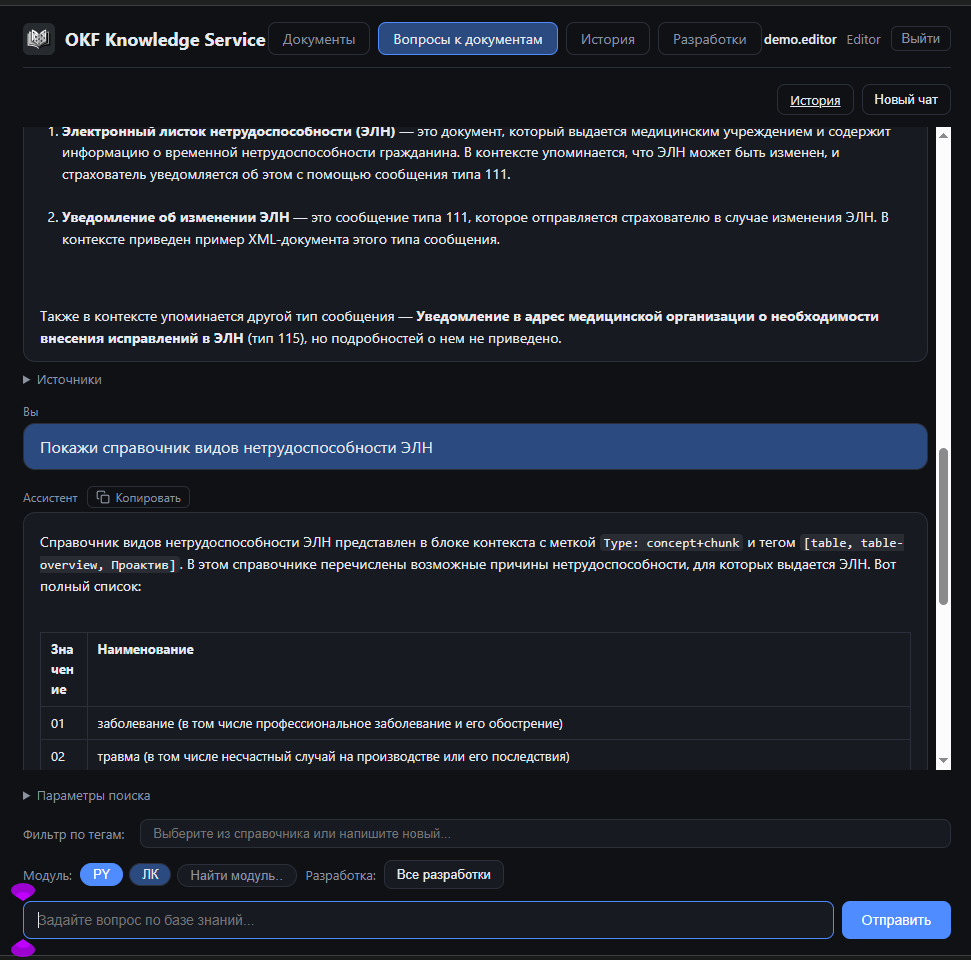
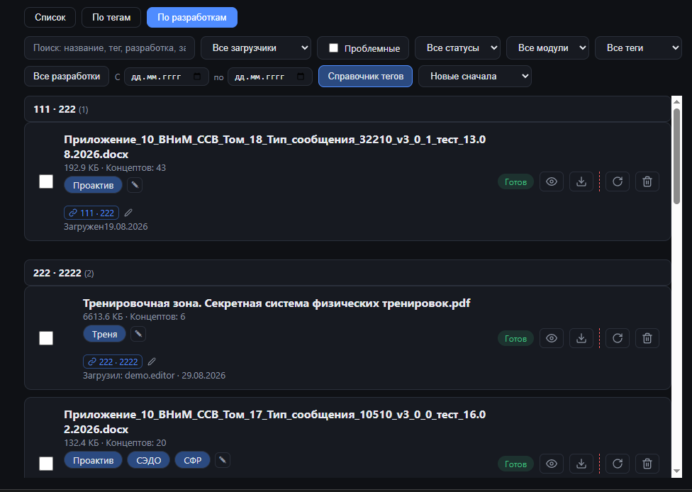
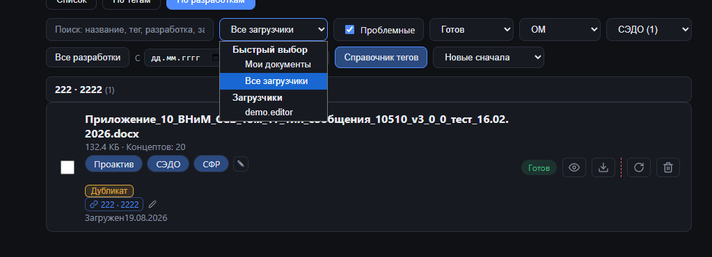
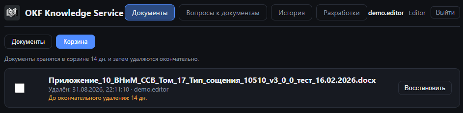
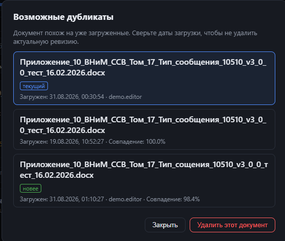
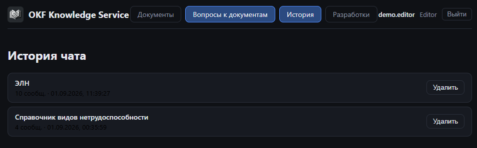
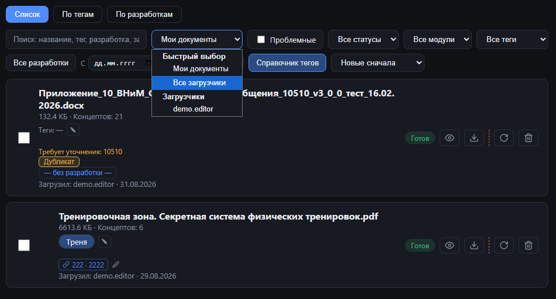

# OKF Knowledge Service

## Зачем это нужно именно вам

Команда SAP HCM годами накапливает документацию: функциональные и технические спецификации, инструкции, описания разработок по модулям PY, PT, OM, PA. Найти в этом массиве нужный ответ — "как было реализовано поле lnState в 111-й разработке", "какие статусы ЭЛН у нас обрабатываются", "есть ли уже документ по интеграции с СЭДО" — обычно означает открыть десяток файлов и пролистать их вручную, потому что стандартный полнотекстовый поиск не понимает смысл вопроса, а просто ищет совпадение слов.

OKF Knowledge Service — это внутренний сервис, куда вы загружаете свою проектную документацию (docx/xlsx/pdf), а он превращает её в базу знаний, по которой можно **спрашивать на обычном языке** и получать ответ со ссылками на конкретные места в исходных документах. Это не замена документации, а способ быстро её находить и переиспользовать.

## Коротко: что сервис умеет

- **Отвечает на вопросы по вашей документации**, а не выдумывает — каждый факт в ответе подкреплён ссылкой на конкретный документ и место в нём.
- **Понимает синонимы и смысл**, а не только точные слова — можно спросить своими словами, не подбирая точную терминологию из документа.
- **Разбирает узкоспециализированные таблицы** — например, таблицы полей XML-сообщений (СНИЛС, статусы, коды) разбираются построчно и гарантированно попадают в базу поиска, даже если таблица на 40+ строк.
- **Знает, к какой разработке и модулю относится документ** — можно спросить "что у нас есть по разработке 12010" или сразу отфильтровать поиск по модулю PY/PT/OM/PA.
- **Не теряет удалённые файлы навсегда** — есть корзина с восстановлением, как в облачных хранилищах.
- **Хранит историю ваших разговоров с сервисом**, чтобы можно было вернуться к прошлому обсуждению.

Дальше — подробности по каждому пункту с описанием, как этим пользоваться на практике.

---

## Как устроен поиск и почему ему можно доверять

### Что происходит с документом после загрузки

Когда вы загружаете `.docx`, `.xlsx` или `.pdf`, сервис не просто индексирует текст целиком. Специальный модуль на основе языковой модели (LLM) разбирает документ на смысловые фрагменты — **концепты**: например, отдельный концепт на каждое поле XML-сообщения, отдельный концепт на каждую бизнес-ситуацию или определение термина. У каждого концепта есть заголовок, теги и связи с другими концептами.

Это важно для вас на практике: если документ описывает, скажем, 30 полей сообщения об электронном больничном листе, сервис не сольёт их в один смысловой ком — каждое поле остаётся отдельно найденным объектом, и вопрос "что такое поле lnState" находит именно нужный фрагмент, а не всю простыню документа.

### Как сервис ищет ответ на ваш вопрос

Когда вы задаёте вопрос в чате, происходит поиск сразу по трём независимым направлениям, результаты которых затем объединяются:

| Способ поиска | Что он находит |
|---|---|
| Смысловой (векторный) | Документы и фрагменты, близкие по смыслу к вопросу, даже если слова другие |
| По ключевым словам (BM25) | Точные термины, коды, аббревиатуры — то, что смысловой поиск может упустить |
| По связям между концептами | Соседние по смыслу фрагменты, на которые ссылается найденный концепт |

Дополнительно к смысловым выжимкам (концептам) сервис хранит и **сырой текст** каждого фрагмента документа — это подстраховка на случай, если при первичной обработке LLM что-то упустила (например, точный URL, код ошибки, номер параметра). Если ответ не находится в выжимке, поиск может зацепить сырой фрагмент напрямую.

**Почему это полезно вам:** если вы спросите одно и то же двумя разными формулировками ("статус ЭЛН" и "код состояния электронного больничного"), велика вероятность получить один и тот же корректный результат, а не два разных или пустой ответ, — потому что поиск не завязан только на точное совпадение слов.

### Источники — не просто список ссылок

Под каждым ответом сервис показывает блок **«Источники»** — конкретные документы и фрагменты, на основе которых сформирован ответ. Каждая ссылка в тексте ответа, помеченная как `[1]`, `[2]` и так далее, кликабельна и ведёт на соответствующий источник, а под каждым источником в списке — короткий фрагмент текста (сниппет), чтобы можно было быстро проверить контекст, не переходя в сам документ.

Это ключевое отличие от обычного чат-бота: сервис **не отвечает "из головы"**. Он собирает ответ строго из найденных фрагментов ваших документов и всегда явно указывает, откуда взят каждый факт. Если по вопросу ничего релевантного не найдено, это будет видно по пустому или скудному блоку источников — сигнал, что стоит либо переформулировать вопрос, либо такой документации в базе ещё нет.

---

## Теги, модули и разработки — как сервис знает контекст

### Модули PY/PT/OM/PA

В интерфейсе чата над полем ввода вопроса есть чипы (кнопки) с обозначениями модулей — например PY, PT, OM, PA — по которым вы работаете чаще всего. Клик по чипу сужает поиск только до документов этого модуля, что резко повышает точность, если у вас есть похожие термины в разных модулях.

Список последних используемых чипов персональный — сервис запоминает, с какими модулями вы работали последними именно вы, и держит их под рукой, а полный список всех модулей доступен через поле поиска рядом с чипами (актуально, так как число внедрённых продуктов и, соответственно, модулей продолжает расти).

### Номер и название разработки

Если документ относится к конкретной разработке (например, "12010 — Доработка расчёта больничных"), сервис пытается определить номер и название разработки автоматически — сначала по имени файла, а если не получилось, то по титульному листу документа через LLM. Найденный номер разработки показывается вам как **предложение для подтверждения**, а не сразу проставляется — вы одним кликом соглашаетесь или поправляете.

Разработка при этом одновременно ведёт себя как обычный тег (её можно искать в общем поиске так же, как любое ключевое слово) и как отдельная сущность со своей карточкой — клик по номеру разработки в карточке документа переносит на страницу этой разработки со списком всех связанных документов.

### Прогресс разметки базы

Наверху вкладки «Документы» есть индикатор общего прогресса — например, «78% документов размечены модулем/разработкой». Документы без разметки помечаются жёлтой плашкой «Черновик — требует разметки», чтобы было видно, какие документы стоит доразметить для более точного поиска в будущем. Разметка не блокирует загрузку — это мягкое напоминание, а не обязательное требование.

---

## Организация документов: группировка, фильтры, поиск списка

### Два режима отображения

Список документов можно переключать между обычным списком, группировкой **«По тегам»** и группировкой **«По разработкам»**. В режиме группировки документы разбиваются на секции с заголовками (тег или номер/название разработки), заголовок секции остаётся видимым при прокрутке — удобно ориентироваться в длинном списке.

### Фильтры

Панель фильтров над списком документов позволяет сузить выборку по автору загрузки, диапазону дат, статусу обработки (готов / в обработке / ошибка), номеру разработки и произвольным тегам. Фильтры комбинируются между собой, и весь набор активных фильтров сохраняется в ссылке (URL) — можно скопировать ссылку и отправить коллеге, чтобы он увидел точно такой же отфильтрованный список, не настраивая фильтры заново.

### Важная особенность списочных вопросов в чате

Если вы спросите в чате что-то вроде "какие документы есть по модулю PY" или "сколько всего разработок без документации" — учтите: чат отвечает на основе смыслового поиска по фрагментам, а не сканирует весь реестр документов целиком. Для таких вопросов сервис сам отвечать не умеет.

**Практический совет:** для "найди мне документ про X" используйте чат — это его сильная сторона. Для "покажи все документы модуля PY" используйте список документов с фильтром — это точнее и быстрее.

---

## Что происходит с документом, если его удалить

Случайное удаление не означает потерю данных навсегда. Удалённые документы попадают в раздел **«Корзина»** — точно так же, как в SharePoint, OneDrive или Google Диске. В корзине видно, кто удалил документ, когда, и сколько дней осталось до окончательного удаления. Восстановление доступно в любой момент в течение этого окна, включая массовое восстановление нескольких документов сразу.

Если при восстановлении окажется, что за время нахождения документа в корзине кто-то уже загрузил похожий (например, более новую версию того же файла), сервис покажет предупреждение о конфликте и предложит выбрать: восстановить как отдельный документ, связать с существующим или заменить.

### Защита от дублей при загрузке

Если вы загружаете файл, который уже есть в системе (тот же файл, тот же текст в другом формате, или похожая версия документа), сервис это обнаруживает и предупреждает до завершения загрузки — предлагая либо отменить загрузку, либо явно отметить, что это новая версия существующего документа, либо продолжить как отдельный файл. Это экономит время на поиск дублей вручную и не даёт базе знаний захламляться копиями одного и того же документа под разными именами.

---

## История переписки с сервисом

Все ваши диалоги с чатом сохраняются в разделе **«История»**, доступном только вам — никто другой не видит ваши разговоры (за исключением случая расследования инцидента сотрудником службы безопасности, что всегда фиксируется в защищённом журнале аудита). Историю можно открыть, продолжить прежний диалог или начать новый. Каждый сохранённый ответ хранит те же источники, что были показаны при генерации, — то есть открыв старый диалог месяц спустя, вы увидите точно ту же картину, что видели тогда, даже если исходные документы с тех пор изменились.

История хранится ограниченное время (настраиваемый срок, по умолчанию — несколько месяцев), после чего автоматически архивируется — так же, как это устроено во многих привычных чат-сервисах.

---

## Роли и права доступа

Доступ к сервису разграничен по ролям, что особенно полезно при совместной работе над одной разработкой:

| Роль | Что доступно |
|---|---|
| Viewer | Поиск и просмотр общей базы документов и чата |
| Editor | Всё то же плюс загрузка документов, редактирование тегов и разметки |
| Admin | Административные операции, массовые действия, управление пользователями |
| Security | Просмотр журнала действий (аудита) для контроля и расследований |

Для Editor/Admin в списке документов доступно переключение между «Мои документы» и «Все документы» — удобно видеть, кто ещё что загрузил по вашей разработке, не теряя фокус на своих файлах по умолчанию.

---

## С чего начать

1. Загрузите один-два своих документа (спецификацию или инструкцию, желательно с таблицами полей или структурированными разделами) — посмотрите, как сервис их разберёт на концепты и предложит номер разработки/модуль.
2. Задайте в чате конкретный вопрос по содержимому загруженного документа — оцените точность ответа и удобство перехода по источникам.
3. Попробуйте чипы модулей и фильтры в списке документов — почувствуйте разницу между "спросить чат" и "найти списком по фильтру".
4. Проверьте раздел «Корзина» на тестовом документе — убедитесь, что восстановление работает интуитивно.

Чем активнее команда пользуется поиском и подтверждает/поправляет разметку тегов и разработок, тем точнее становится поиск для всех — это общая база знаний, а не личный архив каждого пользователя.
