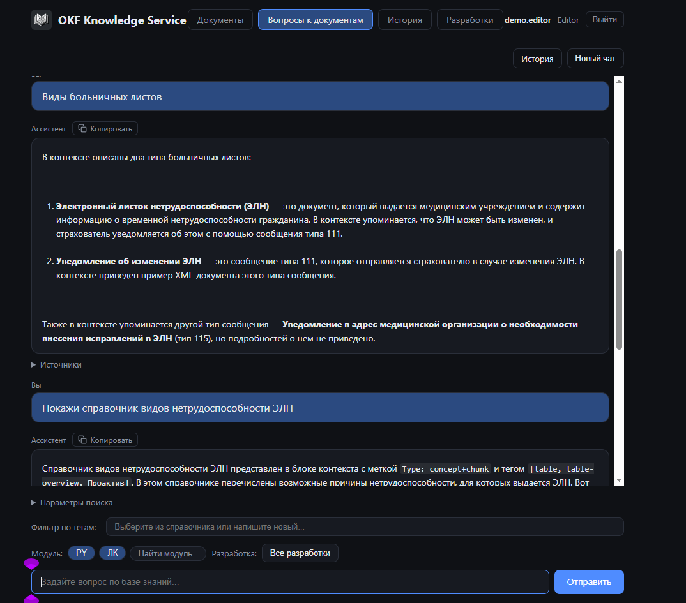
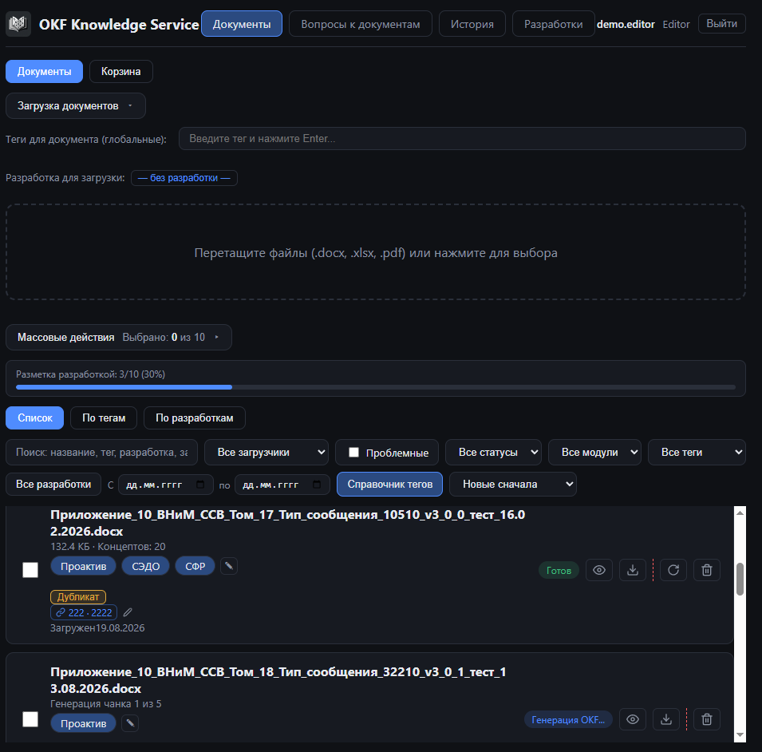
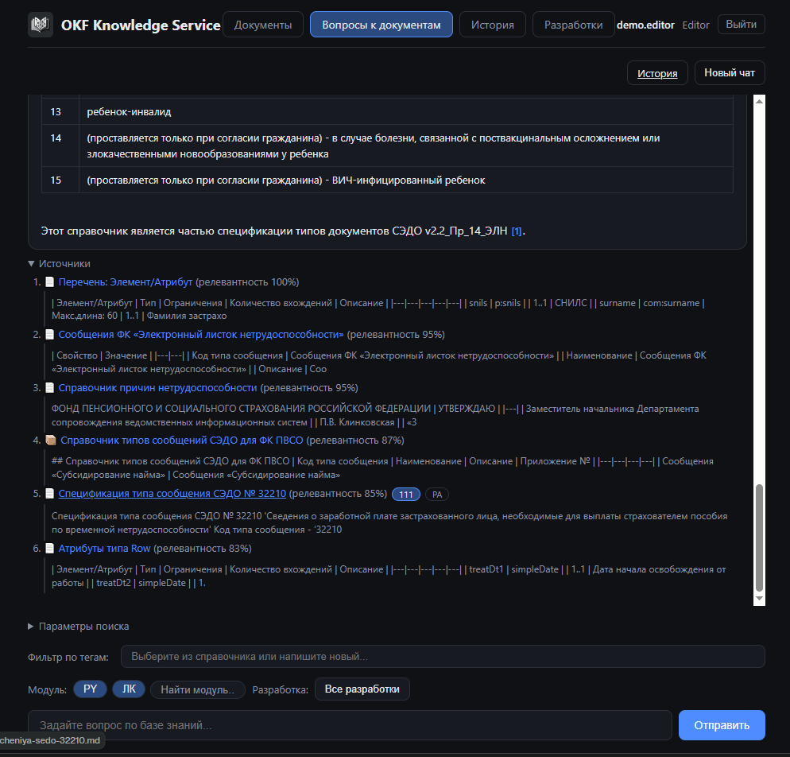

# OKF Knowledge Service

[English](README.md) · **Русский** · [Español](README.es.md) · [Deutsch](README.de.md)

Превращает проектную документацию (DOCX / XLSX / PDF) в базу знаний с умным поиском: LLM
разбивает документы на смысловые **концепты** (Open Knowledge Format), гибридный векторный
индекс хранит их для поиска, а интерактивный чат отвечает на вопросы **строго по вашим
документам и со ссылками на источники**.

Сделано под реальную боль: большой накопленный массив функциональных и технических
спецификаций, где обычный полнотекстовый поиск не отвечает на вопросы вида *«как был
реализован признак `lnState` в разработке 111»* или *«какие статусы ЭЛН мы обрабатываем»*.
Поиск по ключевым словам находит совпадения слов, но не смысл. Этот сервис находит смысл —
и всегда указывает на конкретное место в исходном документе.

## Ключевые возможности

- **Смысловое выделение концептов (OKF).** LLM разбивает документы на осмысленные концепты
  (концепт на поле сообщения, бизнес-правило, определение термина) с YAML-метаданными
  (`type`, `title`, `tags`, `relations`) — вместо непрозрачных полнотекстовых блоков.
- **Детерминированный разбор таблиц полей.** Таблицы перечислений и XML-полей обрабатываются
  *программно* (концепт на строку) с опциональным LLM-классификатором — каждая строка
  (`lnState`, `snils`, …) гарантированно находится даже в таблицах на 40+ строк.
- **Комментарии рецензентов как структурированные данные.** Комментарии из `.docx`
  разбираются в ветки «вопрос → ответ», индексируются и ищутся по тегу `review`.
- **Гибридный поиск.** Двойной индекс по LLM-выжимкам концептов **и** сырому тексту чанков;
  плотные эмбеддинги + разреженный BM25, объединённые через Reciprocal Rank Fusion, плюс
  расширение по графу связей концептов. Предфильтрация по тегам. Три режима запроса:
  `dense`, `bm25`, `hybrid`.
- **RAG-чат со ссылками на источники.** Ответ синтезируется строго из найденных фрагментов,
  каждый факт помечается ссылкой `[N]`, под ответом показываются сниппеты источников.
- **PostgreSQL как источник истины.** Документы, теги, концепты, чанки и staging живут в
  PostgreSQL; Qdrant хранит компактные векторные проекции, полный текст подтягивается при
  чтении.
- **Дедупликация при загрузке.** Хеш файла (уровень 1) плюс хеш содержимого и MinHash/LSH
  (уровни 2–3) предупреждают о дубликатах и почти-дубликатах.
- **Аутентификация и RBAC.** Подключаемые провайдеры аутентификации, SSO через
  Keycloak/OIDC (Authorization Code), роли `viewer` / `editor` / `admin` / `security`,
  по умолчанию fail-closed.
- **Операционная безопасность.** Журнал аудита только на добавление (на проде — учётка БД
  с правом только INSERT), принцип «четырёх глаз» и лимиты для массовых операций,
  блок-лист пользователей.
- **Прод-удобства.** Корзина с мягким удалением, восстановлением и очисткой по сроку
  хранения, история сессий чата, реестр «документ ↔ разработка/модуль» для фильтрации и
  группировки.
- **Устойчивый LLM-конвейер.** Стриминг с таймаутами простоя, каскады повторов,
  восстановление после обрыва (увеличение max tokens → дробление чанка → salvage),
  чекпоинты по чанкам с `resume`.
- **Многоязычный интерфейс (RU/EN)** со стоп-словами из данных, переводами справочников и
  словарями UI, подгружаемыми в рантайме.

## Скриншоты

| Чат с вопросами и ответами | Загрузка документа и статус | Источники под ответом |
|---|---|---|
|  |  |  |

## Как это работает

```
Загрузка (docx / xlsx / pdf)
        │
        ▼
┌──────────────────────────┐   ┌──────────────────────┐   ┌───────────────────┐
│ Парсер документов        │──►│ Генератор OKF (LLM)  │──►│ PostgreSQL        │
│ docx/xlsx/pdf, таблицы,  │   │ смысловая нарезка,   │   │ документы, теги,  │
│ комментарии рецензентов, │   │ строки таблиц полей, │   │ концепты, чанки   │
│ встроенные вложения      │   │ ветки комментариев   │   │ (источник истины) │
└──────────────────────────┘   └──────────────────────┘   └─────┬─────────────┘
                                                                │ эмбеддинги
                                                                ▼
┌──────────────┐   ┌──────────────────────────────────────────────────┐
│ Веб-чат (UI) │◄──│ Qdrant: гибридный поиск                          │
│ (Next.js)    │   │ двойной индекс концептов и чанков,               │
└──────────────┘   │ dense + BM25 + граф, RRF-фьюжн, фильтры по тегам │
                   └──────────────────────────────────────────────────┘
```

1. **Загрузка и API** — Python **FastAPI**; `POST /api/documents`, асинхронная обработка.
2. **Парсинг** — отдельный пакет **`doc-parser`**: `python-docx` (текст, комментарии
   рецензентов, встроенные OLE-объекты), `openpyxl` (листы → Markdown), `pypdf`;
   рекурсивное извлечение вложений.
3. **Генерация OKF** — LLM (локальная через Ollama/vLLM или облачная через
   LiteLLM/OpenRouter) разбивает текст на концепты; таблицы перечислений и XML-полей
   извлекаются программно, построчно.
4. **Хранение** — PostgreSQL — канонический склад метаданных, концептов и чанков; Qdrant
   хранит векторы (dense + sparse BM25) для двух типов точек: `concept` (LLM-выжимки) и
   `chunk` (сырой текст, чтобы детали, которые LLM могла уронить — URL, коды, конфиги —
   всё равно находились).
5. **Поиск** — запрос эмбеддится и прогоняется по веткам dense / bm25 / hybrid (RRF-фьюжн
   на Python); попадания объединяются и схлопываются по исходному фрагменту и фильтруются
   по тегам.
6. **Чат** — LLM пишет ответ по найденному контексту и помечает каждый факт `[N]`;
   источники (заголовок, сниппет, скор) возвращаются отдельно и отрисовываются как
   кликабельные ссылки.

## Стек технологий

| Слой | Технология |
| :-- | :-- |
| Backend | Python 3.12, FastAPI, SQLAlchemy 2.0, LiteLLM |
| Frontend | Next.js (App Router), JavaScript |
| Векторная база | Qdrant (dense + sparse BM25 в одной коллекции) |
| База метаданных | PostgreSQL (для разработки — запасной вариант SQLite) |
| Парсер | Собственный пакет `doc-parser` (python-docx, openpyxl, pypdf) |
| LLM / эмбеддинги | Любой endpoint, совместимый с OpenAI API (Ollama, vLLM, OpenRouter, …) |

## Быстрый старт

### Docker (полностью локальный стек)

```bash
cp .env.example .env
# Направьте .env на локальные сервисы compose и ваш endpoint модели:
#   DATABASE_URL=postgresql+psycopg://postgres:<ваш-пароль>@postgres:5432/okf_knowledge
#   QDRANT_URL=http://qdrant:6333
#   LLM_BASE_URL / EMBEDDING_API_BASE = endpoint вашей модели (например, http://host.docker.internal:11434)
#   ENVIRONMENT=development          # в compose по умолчанию production (fail-fast)
docker compose --profile local-qdrant --profile local-postgres up --build
```

- Интерфейс: http://localhost:8080
- Профили: `local-qdrant` / `local-postgres` поднимают встроенные векторную БД и БД
  метаданных; без них бэкенд подключается к вашим Qdrant / PostgreSQL через `.env`.

### Локальная разработка (без Docker)

```bash
# 1. Бэкенд
cd backend
python -m venv .venv
.venv\Scripts\activate            # Windows
pip install -e ../doc-parser      # пакет разбора документов (editable)
pip install -r requirements.txt
uvicorn app.main:app --reload --port 18000

# 2. Фронтенд (отдельный терминал)
cd frontend
npm install
npm run dev
```

Endpoint'ы моделей и аутентификация настраиваются в `.env` (см. `.env.example` — все ключи
описаны там; никогда не коммитьте реальные секреты). Для локальных запусков установите
`ENVIRONMENT=development`.

## Документация

- **[SECURITY.md](SECURITY.md)** — политика безопасности: модель угроз, границы доверия,
  аутентификация/RBAC, журнал аудита, сроки хранения. *(на английском)*
- Чек-лист продакшен-развёртывания: [PRODUCTION_DEPLOYMENT.md](docs/PRODUCTION_DEPLOYMENT.md) *(на русском)*
- Архитектура и дорожная карта: [OKF_Knowledge_Service_Roadmap.md](docs/OKF_Knowledge_Service_Roadmap.md) *(на русском)*
- Схема БД и миграции: [MIGRATION_PLAN.md](docs/MIGRATION_PLAN.md) *(на русском)*
- Воспроизводимость и качество поиска: [SEARCH_REPRODUCTION.md](docs/SEARCH_REPRODUCTION.md) *(на русском)*
- Руководство пользователя: [OKF_User_Guide.md](docs/OKF_User_Guide.md) / [PDF](docs/OKF_User_Guide.pdf) *(на русском)*
- SSO / Keycloak OIDC: [руководство разработчика](docs/SSO_Keycloak_OIDC_Dev_Guide.md) и
  [руководство по тестированию](docs/SSO_TESTING_GUIDE.md) *(на русском)*
- Добавление языка и админ-инструкции по стоп-словам: [docs/ADD_LANGUAGE.md](docs/ADD_LANGUAGE.md) *(на русском)*
- [AGENTS.md](AGENTS.md) — инженерные заметки и особенности эксплуатации для
  AI-агентов-разработчиков (ведётся на русском; подробная инженерная документация выше
  тоже намеренно на русском — она пишется на рабочем языке автора).

## Лицензия

[GNU Affero General Public License v3.0](LICENSE) (AGPL-3.0).

Зависимость для извлечения текста из PDF — [PyMuPDF](https://github.com/pymupdf/PyMuPDF) —
распространяется под AGPL-3.0, поэтому проект распространяется на тех же условиях. AGPL
дополнительно защищает права пользователей сетевых/облачных развёртываний (исходный код
должен быть доступен любому, кто пользуется сервисом по сети).
