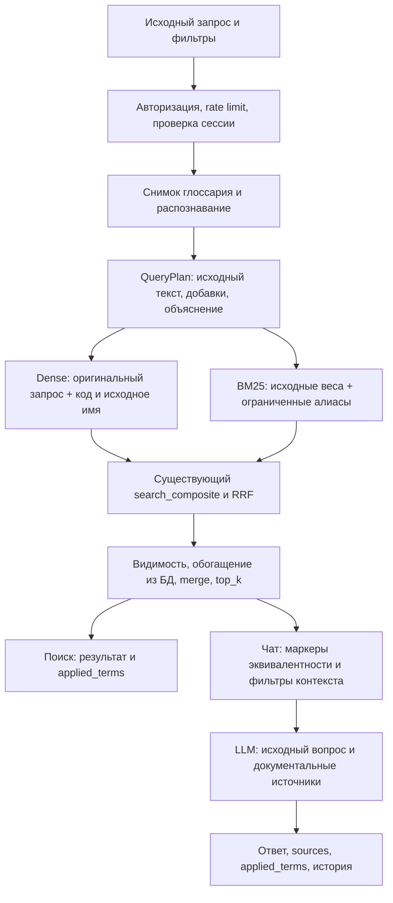

# Доменный глоссарий и расширение поисковых запросов — подробный план

Дата: 11.09.2026. Основание: `glossary_synonyms_plan_v2.md`, фактический код проекта и уточнение пользователя о языке-источнике справочников.

**Статус:** этапы 0–7 выполнены; этап 8 в работе: выполнены предварительные
hybrid off/on-прогоны, подготовлена матрица распознавания. Корпусная разметка
источников, корректность сравнения, полная регрессия и выпуск ещё не приняты.
Порядок завершения и критерии: [план приёмки этапа 8](2026-09-11-glossary-stage8-acceptance.md).

**Goal:** находить документы по эквивалентным доменным обозначениям, сохраняя точность поиска, объяснимость ответа и независимость языков оригинала, интерфейса и документов.

**Architecture:** управляемый справочник PostgreSQL → детерминированное распознавание запроса → подготовка dense/BM25 → существующий composite search → согласованные с расширением фильтры контекста → ответ и снимок объяснения в истории. Во время поиска новые LLM-вызовы не добавляются.

**Tech Stack:** существующие FastAPI/Pydantic, SQLAlchemy/Alembic, PostgreSQL и SQLite для тестов, Qdrant, Next.js/React, существующий LLMClient для перевода справочников.

**Spec:** разделы 1–12 этого документа — проектная спецификация; разделы 13–17 — задачи реализации, проверки и выпуск. Базовая ревизия кода: `5ccb36f`.

> Для последующей реализации: выполнять задачи последовательно по согласованной спецификации, используя `superpowers:executing-plans`; отмечать чекбоксы и проверять результат каждого этапа. Этот документ сам по себе не является поручением запустить реализацию, миграции или перевод данных.

## 1. Что учитывает план

### 1.1. Подтверждённое состояние проекта

| Участок | Сейчас | Следствие для доработки |
|---|---|---|
| `backend/app/api/chat.py`, `api/search.py` | Строят dense и sparse из `req.query` | Расширение вставляется до embed/tokenize |
| `services/vector_store.py::search_composite` | Принимает готовые `dense_vec`/`sparse_vec`, не текст | Предложенная во вложении текстовая сигнатура не соответствует коду; менять её не требуется |
| `services/context_builder.py` | Чат использует `drop_unmatched_blocks`, `drop_partial_title_matches`, `Matched terms`, `Title match` | Одного расширения retrieval недостаточно: источник по синониму иначе может быть удалён после поиска |
| `api/search.py` | Выдаёт merged-блоки без чатовых антишумовых фильтров | Одинаковая подготовка запросов, но существующее различие выдачи поиска и чата сохраняется |
| `services/sparse.py` | Индексная формула общая с существующим корпусом; стоп-слова динамичны только в запросе | Не менять токенизацию документов, хэширование и индексные веса |
| История чата | Сохраняется JSON-снимок `sources`, но нет сведений о расширении | Добавить снимок retrieval metadata у assistant-сообщения |
| Переводы справочников | После `5ccb36f` используется оригинальный текст и `canonical_locale` конкретного элемента | Не вводить общий русский или английский язык-источник |
| `ReferenceLocaleSelect.jsx` | Уже есть общий сворачиваемый выбор языка оригинала | Переиспользовать, сохранив ✎ / выбор / сворачивание / «−» |
| `translation.py` | Поддерживает `source_locale`, но переводит список строк; выборка и запись разнесены | Нужен адаптер для двух полей и защита от ручной правки во время LLM-вызова |
| `audit.py` | Append-only интерфейс; `append()` открывает собственную транзакцию | Для обязательного аудита глоссария нужна запись в транзакции изменения |
| Alembic | Команда `python -m alembic heads` показала `f1a2b3c4d5e6` и `f8d9e0a1b2c3` | Сначала merge revision, потом миграция глоссария |

Вложение v2 ссылается на v1, которой среди доступных материалов нет. Правила нормализации и содержание отложенных фаз ниже — предложенные решения, а не восстановленные дословно требования v1.

### 1.2. Что уже сделано в соседней задаче

В задаче «Перевести справочники от языка источ» и коммите `5ccb36f` реализованы:

- `canonical_locale` у тегов, разработок и атрибутов;
- выбор языка при создании, сохранение первоначального языка при повторном использовании;
- перевод напрямую с оригинала, без промежуточного ru/en;
- `und` для неизвестного источника; переводчик определяет язык из оригинала;
- исключение оригиналов целевого языка и подтверждённых переводов из `_pending_rows`;
- миграция `f8d9e0a1b2c3` и dev-companion `migrate_reference_origin.py`.

Эту функциональность не планируем заново. Глоссарий подключается к ней. При реализации нельзя откатывать уже внесённые изменения к прежней русскоязычной модели.

### 1.3. Границы первого релиза

Рекомендуемый первый рабочий релиз: БД + API + расширение поиска/чата + объяснение и история + интерфейс сопровождения + переводы + небольшой проверенный seed. Интерфейс можно разработать последним этапом, но включать расширение для всех пользователей следует уже с возможностью оперативно отключить ошибочный термин.

За пределами релиза: автоматическое извлечение новых терминов из документов, разрешение неоднозначности моделью, контекстные алиасы модулей/организаций, онтология, многоступенчатый поиск, новая очередь фоновых задач, отдельная страница умного поиска, изменение индекса документов.

## 2. Подходы и выбранное решение

| Подход | Преимущество | Ограничение | Решение |
|---|---|---|---|
| Управляемый query-side справочник | Детерминированность, аудит, отсутствие реиндекса и LLM-задержки | Требует наполнения; эквивалентность нужно проверять | Первый релиз |
| LLM-переписывание каждого запроса | Может понимать свободные формулировки | Дополнительная задержка, стоимость, неоднозначные догадки | Отложить до доказанной потребности |
| Добавление синонимов в документы/индекс | Можно сблизить представления при индексации | Переиндексация, загрязнение текстов, сложный отзыв ошибок | Не применять в этой задаче |

Предлагаются следующие уточнения к v2:

1. Хранить исходное название и описание в ядре термина, как исходные `name`/`label` у существующих справочников. Таблица переводов хранит только переводы. Это устраняет два потенциальных источника оригинала.
2. В первом релизе автоматически расширять только термины, подтверждённые активной записью справочника, кроме системно распознаваемых SAP-инфотипов. Полная форма поддерживаемого префикса и ровно четырёх цифр расширяется query-side без обязательной карточки; карточка при наличии добавляет имя, описание и нестандартные aliases, а один точный код-alias связывает её с инфотипом. Транзакции и остальные виды по-прежнему требуют точного активного alias.
3. Разделить распознавание алиаса и пригодность алиаса для добавления в запрос: это разные решения.
4. Добавить версии оригинала/перевода: одна метка «проверено человеком» не гарантирует актуальность после изменения исходного определения.
5. Не использовать отдельный runtime-кэш глоссария на старте. Небольшой словарь читается одним согласованным снимком на запрос; это упрощает немедленное отключение и работу нескольких backend-процессов.
6. Добавить объяснение в историю и адаптировать фильтры контекста — во вложении эти части отсутствовали.

Эти пункты — рекомендации данного плана. Их можно скорректировать до реализации без изменения основного query-side подхода.

## 3. Общие инварианты

- PostgreSQL — источник истины; SQLite поддерживается тестами. Никаких пользовательских словарей в JSON-файле как параллельной рабочей БД.
- `canonical` — технический идентификатор, он не переводится. Имена/описания — отдельные поля.
- Исходный пользовательский запрос сохраняется в API, истории и вопросе для LLM. Расширенный текст используется только для retrieval.
- Не менять `TOKEN_RE`, `normalize_for_tokens`, `to_sparse_vector` для индексного пути, `_sparse_text`, minhash, эмбеддинги и payload документов. Реиндекс и backfill корпуса не нужны.
- Не менять фильтры tags/dev_tags, source_locales, deleted, постфильтр видимости БД и проверку владельца сессии.
- `top_k` остаётся числом блоков после merge; веса RRF и демоция замечаний сохраняются.
- Никаких сетевых обращений к LLM для определения термина на поисковом пути.
- Алиасы сопоставляются независимо от locale. Перевод сам по себе не становится алиасом.
- Отключённый термин не участвует ни в распознавании для расширения, ни в исходящих добавках, ни в маркерах контекста.
- При выключенном флаге или отсутствии расширения сохраняется прежняя подготовка векторов и фильтрация, включая повторения слов исходного запроса.
- Тексты глоссария — данные, а не инструкции для модели или браузера. Они не превращаются в источники `[N]`.
- Все мутации справочника и переводов аудируются. Исправление — новая запись аудита, а не изменение старой.
- Использовать существующие API proxy, CSRF и роли. В том же релизе обновить соответствующие разделы `SECURITY.md`.

## 4. Языковая модель: четыре независимые величины

| Параметр | Значение | Использование |
|---|---|---|
| `canonical_locale` | Язык исходных `original_name` и `original_description` термина | Источник всех переводов; сохраняется в БД |
| UI locale | Язык интерфейса/запроса API | Отображаемое имя, подписи, ошибки |
| Язык вопроса | Язык исходного пользовательского текста | Существующий выбор языка ответа; не определяется по добавленной аннотации |
| `source_locales` | Фильтр языков документов в выдаче | Только фильтрация документов; не язык перевода термина |

Пример: термин введён на немецком, пользователь работает в английском UI и ищет русский документ по `ИТ 0003`. Источник переводов — немецкий; lookup русского алиаса работает; display может быть английским; фильтр документов остаётся русским; язык ответа определяется существующей логикой по исходному вопросу.

### 4.1. Создание и оригинал

- Форма создания передаёт `canonical_locale` явно, начальное значение — текущий UI locale. Переключение UI после создания не меняет сохранённый источник.
- API/CLI без источника сохраняет `und`, как остальные справочники. `und` не означает русский и не считается целевым языком перевода.
- Язык принадлежит тексту определения, а не коду `IT0003`. Определять язык по одному техническому коду нельзя.
- Имя и описание оригинала предполагаются на одном языке. Если описание смешанное, администратор приводит его к этому языку; схема поязыковых частей текста в первый релиз не входит.
- Оригинал, введённый администратором, считается человеческим источником. Он не участвует в очереди проверки переводов.

### 4.2. Display resolution

Порядок: целевой язык совпадает с `canonical_locale` → оригинал; иначе актуальный перевод целевого языка → оригинал → технический код как аварийный fallback для повреждённых импортных данных.

Машинный актуальный перевод можно показывать с бейджем «Машинный перевод». Устаревший перевод не использовать как основной display: показывать оригинал, а старый текст — в редакторе с отметкой о необходимости проверки.

Вернуть вместе с display поля `display_locale`, `display_is_machine_translated`, `display_is_fallback`; UI не должен угадывать происхождение строки.

Для `/chat` сохранить семантику имеющегося `req.locale`. Для `/search` добавить аналогичный необязательный `locale` с fallback `ru` ради совместимости API; фронт передаёт фактический UI locale. Это только fallback интерфейса, не выбор языка оригинала. Админские GET используют существующий `request_locale(request)`.

### 4.3. Dense annotation

Для первой версии использовать **исходное название термина**, независимо от UI и фильтра документов. Это делает retrieval одинаковым при переключении интерфейса. Добавлять технический код и короткое название; длинное описание в embedding-запрос не включать.

Машинные переводы и переводы, потерявшие актуальность, не участвуют в retrieval. Использование проверенных переводов названия в dense можно оценить отдельным экспериментом; базовый релиз обходится оригиналом и подтверждёнными поисковыми алиасами.

### 4.4. Изменение оригинала

Редактирование названия, описания или исправление `canonical_locale` доступно admin. Это явная операция `PATCH /admin/glossary/{id}/source` с текущей версией термина.

Операция увеличивает `source_revision` и `version`. Существующие переводы сохраняются, но становятся устаревшими: `translation.source_revision != term.source_revision`. Не стирать `reviewed_by` и не перезаписывать человеческий текст автоматически.

Исправление ошибочного `und` на `de` относится сюда же. Смена locale не означает автоматического перевода оригинала. UI формулирует действие как исправление языка сохранённого текста. После смены источника на locale уже существующего перевода тот перевод исключается из display и pending как целевой оригинал; сохраняется для аудита/просмотра и не становится новым источником.

## 5. Схема данных

### 5.1. `domain_terms`

| Поле | Тип/ограничение | Назначение |
|---|---|---|
| `id` | Integer PK | Стабильная внутренняя ссылка |
| `canonical` | VARCHAR(128), NOT NULL, UNIQUE | Технический код, нормализуется по kind |
| `kind` | VARCHAR(48), NOT NULL | `sap_infotype`, `sap_transaction`, `sap_table`, `abbreviation`, `business_term` |
| `original_name` | VARCHAR(256), NOT NULL, непустое | Название на языке-источнике |
| `original_description` | TEXT NULL, API лимит 8000 символов | Исходное определение |
| `canonical_locale` | VARCHAR(16), NOT NULL, default `und` | Язык оригинала; формат существующего `ReferenceLocale` |
| `enabled` | BOOLEAN NOT NULL, default true | Участие в расширении |
| `version` | INTEGER NOT NULL, default 1 | CAS при любых правках термина/алиасов |
| `source_revision` | INTEGER NOT NULL, default 1 | Актуальность переводов |
| `created_at`, `updated_at` | UTC timestamps | История состояния |
| `created_by`, `updated_by` | VARCHAR(255) | Стабильный user_id; имя пользователя также в аудите |

Вместо `UNIQUE(canonical, kind)` из v2 предлагается глобально уникальный код для первого релиза. Иначе глобально уникальные алиасы не смогут однозначно представлять один и тот же код разных kind. Это ограничение одного общего справочника инсталляции; отдельные словари организаций и scoped aliases требуют отдельного решения.

`canonical` и `kind` после создания неизменяемы в первом релизе. Исправления пользовательских форм — алиасами, отключение ошибочного термина — `enabled=false`. Переименование технического ключа с миграцией ссылок — отдельная операция будущей версии, а не обычный PATCH.

Нормализация canonical: trim + ASCII uppercase; для `sap_infotype` строго `IT` + четыре цифры; для остальных kind — непустой технический ключ из ASCII букв/цифр и `_ / . : -`, без пробелов, длина до 128. У ключа должна быть хотя бы одна буква. Namespace `/ABC/XYZ` сохраняется. Содержательные русские/немецкие названия находятся в original_name, не в техническом ключе. Конфликт canonical проверять после нормализации. Добавление нового kind требует явного правила валидации, а не свободной строки из формы.

### 5.2. `domain_term_translations`

| Поле | Тип/ограничение |
|---|---|
| `term_id`, `locale` | Составной PK; FK term_id → domain_terms, CASCADE |
| `display_name` | VARCHAR(256), NOT NULL, непустое |
| `description` | TEXT NULL, API лимит 8000 |
| `source_revision` | INTEGER NOT NULL |
| `version` | INTEGER NOT NULL, default 1; версия конкретной локали |
| `is_machine_translated` | BOOLEAN NOT NULL |
| `reviewed_by`, `reviewed_at` | NULL либо сведения о подтверждении |
| `updated_by`, `updated_at` | Кто/когда записал |

`locale` перевода — зарегистрированный язык (draft/active/disabled допустимы для подготовки и хранения), но не `und`. Его выключение из UI не удаляет перевод и не меняет язык источника. Оригинал не требует активного UI-языка.

PATCH перевода на текущую `canonical_locale` возвращает 422 `glossary_original_is_not_translation` и направляет admin в редактор оригинала. Editor не может изменить оригинал через API переводов.

Ручное редактирование: `is_machine_translated=false`, `reviewed_by=current_user`, `source_revision=current`. Подтверждение машинного текста без правок сохраняет `is_machine_translated=true` и заполняет reviewer: происхождение и факт проверки — разные признаки.

### 5.3. `domain_term_aliases`

| Поле | Тип/ограничение | Назначение |
|---|---|---|
| `id` | Integer PK | Ссылка API/аудита |
| `term_id` | FK, NOT NULL, index | Владелец |
| `alias` | VARCHAR(256), NOT NULL | Исходное написание |
| `normalized_alias` | VARCHAR(256), NOT NULL, UNIQUE | Ключ сопоставления |
| `locale` | VARCHAR(16) NULL | Метаданные происхождения, не фильтр lookup |
| `auto_expand` | BOOLEAN NOT NULL, default false | Может ли входное совпадение запускать расширение |
| `search_enabled` | BOOLEAN NOT NULL, default false | Можно ли добавлять эту форму к распознанному термину |
| `created_at`, `updated_at`, `created_by`, `updated_by` | UTC / user_id | Аудит состояния |

Почему два флага: проверенный нестандартный alias может распознавать термин, но не добавляться в поиск, а дополнительное название — добавляться только после распознавания. Отдельное `0003` не должно запускать системное правило. Короткие `ТР`, `PA`, `PY`, `ОМ` не допускаются ни как автоматические триггеры, ни как автоматически добавляемые общие формы.

Канонический код резервируется служебным alias при создании атомарно с термином; его нельзя удалить или передать другому термину. Для `abbreviation`/`business_term` служебный alias сам по себе не получает автоматических прав. Отключённые записи сохраняют занятые имена, чтобы включение назад не меняло смысл чужих алиасов.

Индекс UNIQUE уже покрывает поиск по `normalized_alias`; второй идентичный индекс из v2 не нужен. FK и ограничения проверяются и на PostgreSQL, и на SQLite. Ограничения длины/пустоты также обязательны в Pydantic, поскольку SQLite не обеспечивает VARCHAR-limit так же, как PostgreSQL.

### 5.4. История

Добавить `chat_messages.retrieval_metadata JSON NULL`. Схема значения:

```json
{
  "schema_version": 1,
  "expansion_status": "applied",
  "applied_terms": [],
  "rules_version": "glossary-v1",
  "ui_locale": "en"
}
```

Сохранять только у assistant-сообщения, вместе с `sources`. В `applied_terms` — снимок фактически применённых данных и версий, не FK-зависимый динамический view. Старые сообщения с NULL отображаются без плашки. Переименование/отключение словарной записи не меняет историю.

## 6. Нормализация и сопоставление

### 6.1. Общий нормализатор алиасов

Отдельная функция `normalize_alias(text)` в новом модуле, не изменение `sparse.normalize_for_tokens`:

1. Unicode NFC, trim, последовательности пробельных символов → один пробел.
2. Lowercase с согласованной обработкой combining dot для латиницы; сохранять диакритику и `ё`.
3. Не выполнять общий транслит, замену кириллицы латиницей, fuzzy matching и удаление пунктуации.
4. Алиасы интерпретировать как литералы, никогда как regex из БД.
5. Для поиска в тексте сохранять mapping нормализованных позиций на исходные, чтобы `matched_text` и offsets относились к запросу пользователя. Регистровые преобразования могут менять длину строки.

Точное сопоставление — по границам идентификаторов. Буквы всех языков, цифры и `_` считаются частью идентификатора; попадание `PA20` внутри `XPA20Y` запрещено. Пунктуация namespace `/ABC/XYZ` сохраняется; крайние `/` входят в код.

### 6.2. Инфотипы

Конечный список поддерживаемых префиксов: латинский `IT`, кириллический `ИТ`, английское `infotype`, немецкое `Infotyp`, русские слитные `инфотип`, `инфотипа`, `инфотипе`, `инфотипу`, `инфотипом` и раздельные/дефисные `инфо-тип` с теми же окончаниями. Между IT/ИТ и числом допустимы пробелы или один дефис; для словесных форм требуется разделитель. Число — ровно четыре ASCII-цифры; короткие номера не дополняются нулями автоматически.

| Вход | Кандидат | Автоматическое действие |
|---|---|---|
| `ИТ 0003`, `IT0003`, `Infotype 0003`, `Infotyp 0003`, `инфо-типа 0003` | `IT0003` | Query-side системное расширение; карточка не обязательна |
| `в инфотипе 0003` | `IT0003` | Распознаётся span `инфотипе 0003` |
| `IT3`, `инфотип 3`, `Infotyp 003` | Нет | Короткий номер не дополняется и не запускает системное правило |
| `3`, `0003` | Нет | Обычный запрос |
| `IT12345`, `IT-0003X`, `XIT0003`, `IT 12.5`, `IT 12,5` | Нет | Не брать допустимый префикс недопустимого числа |
| `IT 0000`, `IT 9999` | Форматный кандидат | Расширить как форматную эквивалентность, но не утверждать существование объекта |
| Смешанный префикс `IТ` | Нет | Только отдельный явно проверенный alias, без глобальной подмены алфавитов |

Диапазоны и перечни `ИТ 0001–0003`, `ИТ 1/3` в первой версии не разворачиваются; подозрительный составной числовой span пропускается целиком, не превращается в один случайный термин. Несколько полностью выписанных кодов распознаются независимо.

Структурная нормализация резервирует эквивалентность полной четырёхзначной формы: нельзя привязать `инфотип 0003` к иному коду. Если несколько повреждённых карточек претендуют на один код, системное правило работает без выбора случайной карточки и её метаданных.

### 6.3. Транзакции и другие коды

- `PA20`/`pa20` → `PA20` только по активной записи `sap_transaction`.
- `/nPA20`, `/oPA20` можно поддержать как явные SAP-командные оболочки: снять `/n` или `/o`, затем требовать точного зарегистрированного кода. Не удалять префиксы у произвольного текста и не менять namespace-коды.
- Коды таблиц и пользовательские Z/Y-коды работают через явно зарегистрированные алиасы/канонический alias. Не пытаться классифицировать любой алфавитно-цифровой токен как SAP-объект.
- Голое название/описание термина не становится триггером автоматически. Admin может добавить проверенную фразу как отдельный alias.
- `ТР`, `PA`, `PY`, `ОМ` и латинское `OM` — принудительный denylist автоматического расширения независимо от регистра. Попытка включить запрещённые флаги — 422, а не молчаливый сброс в UI.
- Другие короткие формы менее трёх букв также не получают автоматических прав. Числовой `search_enabled` — только четыре цифры у `sap_infotype`, default выключен до корпусной проверки.

### 6.4. Приоритеты и ограничения

Распознавать только исходный запрос, без рекурсивного расширения результатов. Для пересечений: более длинный проверенный alias → структурный кандидат → более короткий alias; сортировка детерминированна. Конфликт значений от разных механизмов → пропуск с диагностикой, не угадывание.

Повторные упоминания одного термина объединяются в одну запись с несколькими spans. Порядок терминов — по первому появлению, исходящих алиасов — по нормализованному имени/ID. При лимитах сохраняется этот же порядок.

Стартовые параметры конфигурации:

| Параметр | Значение |
|---|---:|
| `GLOSSARY_QUERY_EXPANSION_ENABLED` | false до приёмки |
| `GLOSSARY_MAX_TERMS_PER_QUERY` | 5 |
| `GLOSSARY_MAX_ALIASES_PER_TERM` | 50 при записи |
| `GLOSSARY_MAX_ADDED_ALIASES_PER_TERM` | 4 |
| `GLOSSARY_MAX_ADDED_TOKENS` | 32 |
| `GLOSSARY_MAX_ADDED_CHARS` | 768 |
| `GLOSSARY_SPARSE_EXPANSION_WEIGHT` | 1.0 по умолчанию; единый коэффициент для всех допущенных форм запроса, с возможностью явного изменения администратором |

Исходный лимит `QueryText=8192` сохраняется. При нехватке бюджета пропускать целые добавки, не обрезать код посередине. Если исходный запрос уже занимает embedding-бюджет, expansion не применяется. `applied_terms` отражает только фактически использованные добавки, а не все распознанные кандидаты.

## 7. Поисковый поток



### 7.1. Контракт подготовки

Новые внутренние типы в `services/glossary/types.py`:

```python
@dataclass(frozen=True)
class QueryPlan:
    original_query: str
    dense_query: str
    added_sparse_texts: tuple[str, ...]
    match_groups: tuple[MatchGroup, ...]
    applied_terms: tuple[AppliedTerm, ...]
    status: str  # disabled | no_match | applied | limited | unavailable
    rules_version: str = "glossary-v1"

def prepare_query(query: str, *, ui_locale: str, enabled: bool) -> QueryPlan: ...
def build_query_sparse(plan: QueryPlan, *, stopwords: Collection[str]) -> SparseVector: ...
```

`MatchGroup` содержит term_id, исходные spans, канонический код и ограниченный набор фактически активированных эквивалентных форм. `AppliedTerm` определён в §8. Модули не импортируют API-роутеры.

При выключенном флаге не читать БД глоссария. При включённом — одна короткая сессия, один согласованный SELECT с join термина, aliases и нужного перевода display, затем immutable snapshot; не держать сессию во время embed/Qdrant/LLM. Ограничить стартовый эксплуатационный размер до 1000 терминов/10000 алиасов и замерить стоимость; превышение требует оптимизации lookup до массового наполнения, а не незаметного медленного сканирования.

Админский preview может строить QueryPlan при глобально выключенном флаге, но только в preview API. Обычный пользователь не может принудительно включить глобально выключенную функцию.

### 7.2. Dense

Один embed-вызов, как раньше. Пример добавки: `\n[Domain term: IT0003 — <original_name>]`. Маркер фиксированный, имя очищено от управляющих символов и ограничено бюджетом. Исходный вопрос не заменяется названием.

Не отправлять original_description в embedding и prompt. Глоссарий помогает связать названия, но не даёт новых документальных фактов. Ответ не должен сообщать определение исключительно из глоссария при отсутствии источника.

### 7.3. Sparse: не склеивать бесконечный список

Простой `original + все aliases + description` раздувает TF и добавляет общие слова. Вместо этого новый query-only builder:

1. Построить исходный sparse существующим `to_sparse_vector(original, stopwords=...)` без изменений.
2. Добавки — canonical и aliases с `search_enabled=true`, в пределах бюджета; описание и переводы названия не включать.
3. Токены добавок дедуплицировать. Не увеличивать вес индекса, уже присутствующего в исходном sparse.
4. Sparse добавки строить тем же существующим хэшем через `to_sparse_vector`; все допущенные формы (явные алиасы и формы активных правил) добавлять одним общим коэффициентом. По умолчанию коэффициент равен 1.0, поэтому источник формы и порядок её добавления не меняют силу sparse-сигнала. Перед одним вызовом `to_sparse_vector` добавки дедуплицируются по токенам.
5. Объединить индексы с сохранением исходных весов; коллизии добавок не суммировать повторно, итог отсортировать, не допускать NaN/пустых/повторных индексов.

Алгоритм относится только к запросам. Для режима bm25 embed не вызывается; для dense sparse не строится. Если флаг ветки выключен сервером, объяснение не утверждает применение в этой ветке.

Qdrant lexical retrieval всё ещё не обеспечивает точный поиск фразы. Добавка `0003` может найти посторонний числовой код, поэтому каждая форма должна быть явно допущена термином или правилом и проверяться boundary-safe сопоставлением; после допуска форма получает тот же коэффициент, что и любая другая форма.

### 7.4. Маркеры и постфильтрация

Нельзя передавать всю расширенную строку в существующий `drop_partial_title_matches`: тогда все синонимы становятся обязательными словами заголовка. Использовать группы эквивалентности.

- `matched_terms` сохраняет буквальные совпадения исходного запроса.
- Дополнительно вычисляется `matched_domain_terms`: какой термин найден в блоке через какую полную форму. Совпадение только слова «инфотип» или цифры `3` не подтверждает IT0003.
- `drop_unmatched_blocks`: блок подходит по прежнему буквальному правилу **или** по полной безопасной форме активированной группы. Иммунитет `kind=review` сохраняется. При полном отсутствии любых совпадений остаётся старый парафразный fallback.
- Для exact-title логики исходный распознанный span становится одной группой OR-эквивалентов; остальные значимые слова остаются обязательными AND-условиями. Имена/описания из аннотации не становятся новыми условиями.
- Для запросов с распознанным термином фильтр точного объекта допускается только при одной группе термина и полном покрытии остальных значимых слов заголовком. Для двух и более разных терминов новый exact-title фильтр не сужает контекст: иначе сравнение `IT0001 и IT0003` может потерять одну сторону. Legacy-поведение запросов без расширения сохраняется.
- Если в заголовке найдено только `0003`, это не считается сильным exact-title совпадением. Нужна полная кодовая/префиксная/явно проверенная фразовая форма.
- У прошедшего exact-title `concept+chunk` сохраняется существующая подмена на `concept_content`.
- Формат metadata дополняется `Matched domain terms: [IT0003 via IT 0003]`, с экранированием значений. LLM получает исходный вопрос и документальный контекст, номера `[N]` соответствуют окончательному списку blocks/sources.

Рекомендуемые сигнатуры с обратной совместимостью: `drop_unmatched_blocks(merged, query, *, match_groups=())`, `drop_partial_title_matches(merged, query, *, match_groups=())`, `format_context(merged, query=None, *, match_groups=())`. Empty tuple должен давать прежний результат.

### 7.5. Сбои и изменение словаря

- Пустой глоссарий → `no_match`, обычный поиск.
- Ошибка чтения именно глоссария → `unavailable`, обычный запрос, warning без полного пользовательского текста. Это не маскирует ошибки основной БД документов или Qdrant.
- Синтаксически повреждённая запись → пропуск этой записи, диагностический счётчик, остальные работают.
- Нельзя «fail-open» на ошибке авторизации, ограничениях запроса или конфликте записи справочника.
- После успешной мутации следующий запрос получает новое состояние без TTL. Уже выполняющийся запрос заканчивает работу со своим снимком; это допустимая граница применения изменений.
- У runtime-снимка нет ORM lazy-loading после закрытия сессии.

## 8. API, права и прозрачность

Все пути таблицы указаны относительно существующего `/api`. Статические `/translations/*`, `/preview` объявляются до `/{id}`. ID — Integer, не канонический код в URL.

| Метод и путь | Доступ | Назначение |
|---|---|---|
| GET `/admin/glossary` | admin/editor | Пагинация, q, kind, enabled, alias_locale, needs_review, target_locale |
| GET `/admin/glossary/{id}` | admin/editor | Оригинал, источник, все переводы, aliases, версии |
| POST `/admin/glossary` | admin | Создать ядро + служебный alias + начальные aliases атомарно |
| PATCH `/admin/glossary/{id}` | admin | `enabled`, с обязательным `version` |
| PATCH `/admin/glossary/{id}/source` | admin | Исходные имя/описание/язык, с `version` |
| POST `/admin/glossary/{id}/aliases` | admin | Новый alias, с версией термина |
| PATCH `/admin/glossary/{id}/aliases/{alias_id}` | admin | Изменение формы/флагов/метаданных, с версией термина |
| DELETE `/admin/glossary/{id}/aliases/{alias_id}` | admin | Удалить неслужебный alias, version обязателен |
| PATCH `/admin/glossary/{id}/translations/{locale}` | admin/editor | Ручной перевод; версии перевода и исходника |
| POST `/admin/glossary/{id}/translations/{locale}/review` | admin/editor | Подтвердить текущий текст; версии перевода и исходника |
| GET `/admin/glossary/translations/pending` | admin/editor | Отдельно missing, machine_unreviewed, human_stale, machine_stale, eligible_for_backfill |
| POST `/admin/glossary/translations/backfill` | admin | Ограниченный пакет, глобальный provider, общий переводческий путь |
| POST `/admin/glossary/preview` | admin/editor | Только нормализация/план запроса: без LLM/Qdrant и без изменения БД |

Физическое удаление термина не включать в первый релиз: `enabled=false` сохраняет ID, историю и занятые формы. Если потребуется очистка ошибочных черновиков — отдельный admin-сценарий с явным аудитом, не скрытая каскадная операция.

Роль editor видит оригинал и aliases, но изменяет только переводы. Роль security не получает права редактирования; аудит доступен по существующей модели. User получает `applied_terms` только в своих поисковых/чатовых ответах, без служебных полей авторов и полного дампа глоссария.

Ошибки: 401/403 штатные; 404 `glossary_term_not_found`/`glossary_alias_not_found`; 409 `glossary_alias_conflict`, `glossary_canonical_conflict`, `version_conflict`; 422 `glossary_invalid_alias`, `glossary_unsafe_auto_expand`, `glossary_original_is_not_translation`, `glossary_invalid_locale`. Конфликт UNIQUE ловится после rollback, не отдаётся как 500. URL locale — единственный источник целевой локали; не дублировать его в теле запроса.

### 8.1. Совместимость `/chat` и `/search`

Добавить `use_glossary: bool = true` к обоим request. Эффективное включение = глобальный флаг AND request.use_glossary. Поля response:

```json
{
  "query": "Что меняют в ИТ 0003?",
  "expansion_status": "applied",
  "applied_terms": [
    {
      "term_id": 12,
      "canonical": "IT0003",
      "kind": "sap_infotype",
      "display_name": "Название из справочника",
      "display_locale": "ru",
      "display_is_machine_translated": false,
      "display_is_fallback": false,
      "canonical_locale": "de",
      "term_version": 3,
      "source_revision": 1,
      "matched_texts": ["ИТ 0003"],
      "match_type": "structural",
      "added_forms": ["IT0003", "IT 0003"],
      "used_in": ["dense", "bm25"]
    }
  ]
}
```

Это фрагмент: остальные поля существующих SearchResponse/ChatResponse сохраняются. `canonical_locale` внутри AppliedTerm — язык оригинала термина; он называется так же, как в реестре, и не смешивается с `source_locales` документов.

`applied_terms=[]` по умолчанию; новые клиенты терпимы к отсутствию поля у старого backend. Нулевой результат поиска всё равно возвращает объяснение применения. Распознанный, но не использованный из-за лимита кандидат не входит в applied_terms; подробные skipped/reason доступны в admin preview.

Не отдавать полный expanded prompt обычному клиенту. Preview показывает исходный и dense текст, sparse-добавки, сработавшие правила, skipped reasons и лимиты; это позволяет сопровождать словарь без запуска платного ответа.

## 9. Переводы, актуальность и конкурентное редактирование

### 9.1. Подключение к существующему механизму

Добавить сущность `glossary` в `backfill_reference_data`, `count_pending`, API/schema entities, CLI `backfill_translations.py` и интерфейс перевода справочников. Старые сигнатуры/результаты для tags/developments/attributes сохранить; новые параметры batch/selection сделать keyword-only с прежними defaults.

Для glossary использовать специализированный адаптер: `(term_id, original_name, original_description, canonical_locale, source_revision)`. Не пытаться закодировать два поля в одну строку и затем разделять по символу: описание может содержать такой разделитель.

Пара name/description переводится через тот же LLMClient: расширить `translate_texts_batch` необязательным keyword-only параметром `strict: bool = False`, а glossary вызывать с `[name, description]`, `source_locale=term.canonical_locale`, `strict=True`, исключая NULL description. В strict-режиме проверять типы элементов сырого ответа **до** существующего `str(x)`; объект/None отклонять. Затем проверить точное число строк, непустое имя и длины. Прежние вызовы переводчика сохраняют свою сигнатуру и поведение. Термин принимается атомарно: повреждённое описание не должно создавать видимость полного перевода.

Источник всегда берётся из ядра термина, никогда из display/current locale или уже существующего перевода. Для `und` передаётся существующее указание определить язык оригинала, но метаданные исходника не переписываются догадкой модели.

### 9.2. Pending и правила перезаписи

| Состояние перевода | В очередь машинного backfill | В очередь ручного ревью |
|---|---|---|
| Целевой язык = canonical_locale | Нет | Нет |
| Нет перевода, термин активен | Да | Пока нет текста для проверки |
| Машинный, не подтверждён, актуален | Да, как существующий backfill | Да |
| Машинный, не подтверждён, устарел | Да | Да |
| Подтверждённый/ручной, актуален | Нет | Нет |
| Подтверждённый/ручной, устарел | Нет: человеческий текст защищён | Да, сравнение с новым оригиналом |
| Термин отключён | Нет по умолчанию | Видим при фильтре «включая отключённые» |

Preview count и выполнение используют одну функцию отбора. Различие количества при конкурентной правке объясняется счётчиком skipped_changed, а не обещанием абсолютного совпадения в изменяемой БД.

### 9.3. Защита от гонок

1. Короткой транзакцией прочитать исходник, его revision и version целевого перевода.
2. Вызвать LLM вне транзакции/row lock.
3. В новой транзакции повторно проверить enabled, source_revision, отсутствие reviewer и version целевого перевода.
4. Условной записью/row lock сохранить результат, только если всё осталось прежним; иначе `skipped_changed` или `skipped_reviewed`.
5. Если другой процесс успел вставить перевод — повторно прочитать и проверить, не делать безусловный upsert поверх ручного.

Ручные PATCH/review принимают `translation_version` (0 для ещё отсутствующей записи) и `source_revision`. Устаревший редактор получает 409 и сохраняет локальный набранный текст для сравнения. Редактирование разных языков не должно конфликтовать только из-за правки соседа; для переводов своя версия, для aliases — версия термина.

### 9.4. Провайдер и длительность

Глобальный `translation_provider=llm|off` остаётся единственным переключателем; не вводить `?provider=llm`, обходящий `off`. При off ручные PATCH и импорт работают; machine-backfill возвращает понятное состояние skipped_provider_off и не создаёт пустых записей.

В текущем коде `translation_model` отображается/логируется, но `LLMClient(interactive=False)` выбирает `llm_model`. До подключения glossary исправить точечно: добавить необязательный `model` override в конструктор LLMClient, передавать `translation_model or llm_model` только из переводчика, сохранив маршруты chat/OKF. Проверить фактический model в mock вызова провайдера, а не только строку лога.

Backfill синхронный, как существующий путь. Для glossary — максимум 10 term_id за один HTTP-запрос, UI вызывает пакеты последовательно и показывает счётчики. Не запускать весь справочник одним длинным запросом и не занимать документную job_queue. CLI может последовательно обработать весь выбранный набор.

Остановка UI прекращает запуск следующих пакетов; уже принятый сервером пакет может завершиться. Таймаут браузера не означает rollback: UI перечитывает состояния выбранных терминов до повторного запуска. Для строгой дедупликации повторов API допускает `expected_translation_versions` по term_id; изменившиеся строки пропускаются. Ограничить время LLM вызова существующими total/idle timeout и число терминов; отдельный жёсткий общий SLA не обещать без замера.

## 10. Аудит

Новые action types: `glossary_term_create`, `glossary_term_update`, `glossary_source_update`, `glossary_alias_create`, `glossary_alias_update`, `glossary_alias_delete`, `glossary_term_translation_update`, `glossary_term_translation_review`, `glossary_translations_backfill`. Target type `glossary_term` (пакетный итог может иметь target locale и batch_id в meta).

- Событие содержит user_id/username, term_id, old/new, изменённые flags/locale, version/source_revision, IP по существующему механизму.
- Переводческий batch имеет итоговые счётчики и отдельный audit old/new на каждый реально изменённый перевод. Итог пакета не заменяет аудит строк.
- Seed пишет те же события с явным actor `system:glossary_seed`; повторный no-op не добавляет события изменений.
- Добавить совместимый `audit.record_in_session(session, user, action_type, target_type, ...)`, использующий тот же построитель AuditLog и перечень ACTION_TYPES. Старый `record()` оставить работоспособным для остальных сценариев.
- Мутация + audit в одной транзакции: ошибка вставки audit отменяет мутацию глоссария. Не разрешать частичное сохранение с успешным HTTP-ответом.
- На PostgreSQL гарантии append-only сверх уровня приложения зависят от прав БД; существующую рекомендацию insert-only сохранить, не заявлять, что текущий API сам обеспечивает неизменяемость против DBA.
- Пользовательские поиски не добавлять в audit_log отдельным событием на каждый запрос. Применение хранится в истории чата/ответе, операционные метрики — без полного текста запроса.

## 11. Интерфейс первого релиза

### 11.1. Сопровождение `/admin/glossary`

Доступ admin/editor, с различием прав на сервере и в UI. Список: canonical, локализованное имя, язык оригинала, kind, active, число aliases, состояние переводов. Фильтры и пагинация серверные, page size 50, max 100. Поиск админки — по коду/оригиналу/переводу/alias через БД, без recursive query expansion.

Карточка имеет три секции:

1. **Оригинал:** code/kind read-only после создания, исходные имя/описание, `ReferenceLocaleSelect`, версия, включение. При правке оригинала показать число переводов, которые потребуют проверки.
2. **Варианты написания:** alias, язык как справочная метка, «Распознавать автоматически», «Добавлять в поиск». У запретных коротких форм — объяснение ограничения. Конфликт показывает существующий term_id/ссылку в рамках доступной admin-карточки.
3. **Переводы:** оригинал рядом с выбранным target, признаки машинного/ручного/устаревшего, редактирование и подтверждение. Для editor оригинал только для чтения; текущая canonical_locale не предлагается как перевод.

Раскрытие полей соответствует принятому паттерну: ✎, сохранение → сворачивание; «−»/Escape → отмена редактирования. Ошибка/409 не очищает черновик. Все кнопки имеют label/aria; доступны Tab/Enter/Escape; поле ошибки связано с input.

«Проверить запрос» показывает только объяснение преобразования. Кнопка сохранять термин и preview — разные действия, preview не применяет несохранённый словарь к живому поиску. Для проверки несохранённых aliases достаточно локальной валидации формы; серверный preview использует сохранённое состояние и явно показывает это.

### 11.2. Чат и история

Под ответом компактная строка: «Учтены обозначения: ИТ 0003 → IT0003». Раскрытие показывает добавленные формы и имя; машинный display помечается. Плашка не является источником и не занимает номер `[N]`.

В настройках поиска переключатель «Учитывать глоссарий», и действие повторить запрос без него. Повтор — новый явный пользовательский запрос с прежними фильтрами, `top_k`, mode и locale; автоматически вторую LLM-генерацию не запускать. В истории показывать сохранённый снимок. Для старых сообщений не выводить «глоссарий не применялся»: сведений об этом просто нет.

Если `unavailable`, неблокирующее сообщение «Поиск выполнен без глоссария». Если `limited`, раскрытие объясняет ограничение. Нулевой результат не должен скрывать факт расширения.

### 11.3. Локализация

Новые строки в ru/en словари; de/fr наследуют существующую модель fallback/override. Обновить `ui_keys.json` и `ui_en.json` через `frontend/scripts/export-ui-keys.mjs`; проверить drift. Код термина никогда не локализуется. Оригинал можно показывать в дополнительной строке с его реальным языком, без обязательной русской/английской справочной скобки.

## 12. Seed и наполнение

Создать versioned файл `backend/seeds/glossary.json` и `backend/scripts/seed_glossary.py`. Это транспорт начальных данных, не runtime-источник. В записи явно указаны canonical, kind, original_name, original_description, canonical_locale, aliases и оба флага.

- Seed только из проверенного списка 10–15 терминов реального корпуса; число — целевой небольшой объём, не повод придумать отсутствующие определения.
- Обязательные тестовые формы: IT0003 и PA20, безопасные структурные варианты, неоднозначные ТР/PA/PY/ОМ как запрещённые к авторасширению записи/fixtures.
- Предметные названия/определения сверить с владельцем справочника или документами корпуса. Этот план не утверждает, какое бизнес-определение должно иметь IT0003 в данной инсталляции.
- Русские термины получают ru потому, что оригинал действительно русский; немецкие de и т.д. Не засевать все записи с ru по умолчанию.
- Ручные переводы seed явно маркируются как reviewed с actor. Машинные не выдаются за проверенные.
- CLI по умолчанию dry-run; `--apply` добавляет отсутствующие записи. Изменённый существующий термин не перезаписывается: отчёт `unchanged/conflict`, явное редактирование через API.
- Перед записью проверить весь файл на внутренние коллизии и конфликт с БД. Для малого seed применение транзакционно целиком; не оставлять половину справочника при ошибке.
- Не запускать seed автоматически в lifespan или миграции. Не оживлять отключённые термины при рестарте.

## 13. Карта файлов

Новые пути — проектные; существующие указаны по проверенному дереву репозитория.

| Файл | Ответственность |
|---|---|
| `backend/app/services/glossary/types.py` | QueryPlan, MatchGroup, immutable snapshot types |
| `backend/app/services/glossary/normalization.py` | Нормализация алиасов, structural matchers, границы |
| `backend/app/services/glossary/registry.py` | CRUD, snapshot SELECT, CAS, конфликты и audit |
| `backend/app/services/glossary/expansion.py` | QueryPlan, лимиты, приоритеты, applied_terms |
| `backend/app/services/glossary/query_sparse.py` | Только query-side добавки sparse |
| `backend/app/services/glossary/matching.py` | Эквивалентность для context_builder |
| `backend/app/services/glossary/translations.py` | Отбор и конкурентно безопасная запись переводов двух полей |
| `backend/app/models/glossary.py` | Pydantic requests/responses, AppliedTerm, ошибки валидации |
| `backend/app/api/glossary.py` | Маршруты admin/editor, preview |
| `backend/app/db/models.py` | Три таблицы и retrieval_metadata |
| `backend/app/models/schemas.py` | Additive поля search/chat/history |
| `backend/app/services/translation.py`, `llm_client.py` | Новая сущность в общей системе и корректный model override |
| `backend/app/api/chat.py`, `api/search.py` | Общая подготовка QueryPlan, прежний retrieval |
| `backend/app/services/context_builder.py` | MatchGroup-параметры, доменные маркеры |
| `backend/app/services/chat_history.py` | Сохранение и чтение снимка |
| `backend/app/services/audit.py`, `api/errors.py`, `main.py`, `config.py` | Audit в транзакции, коды, регистрация маршрута, флаги |
| `backend/alembic/versions/…_merge_auth_reference_origin.py` | Объединение двух heads; ID создаётся при реализации |
| `backend/alembic/versions/…_glossary.py` | Additive схема глоссария и истории |
| `backend/scripts/migrate_glossary.py` | Идемпотентный dev-companion с inspect/verify |
| `backend/scripts/seed_glossary.py`, `backend/seeds/glossary.json` | Проверенный начальный набор |
| `backend/test_scripts/probe_sources.py` | Паритет runtime и before/after для глоссария |
| `backend/scripts/backfill_translations.py` | Поддержка glossary, source locale, пакетного выбора |
| `frontend/src/app/admin/glossary/page.js` | Страница и gate admin/editor |
| `frontend/src/components/GlossaryPanel.jsx` | Список, фильтры, пагинация |
| `frontend/src/components/GlossaryEditor.jsx` | Оригинал и aliases |
| `frontend/src/components/GlossaryTranslations.jsx` | Переводы/review |
| `frontend/src/components/GlossaryPreview.jsx` | Проверка запроса |
| `frontend/src/components/AppliedTerms.jsx` | Общая плашка ответа и истории |
| `frontend/src/components/ChatPanel.jsx`, `ChatHistoryShared.jsx` | Применение плашки и повтор без глоссария |
| `frontend/src/components/Nav.jsx`, `lib/api.js`, `app/globals.css` | Навигация, вызовы API, стили |
| `frontend/src/components/LanguagesPanel.jsx` и используемый ей компонент backfill | Добавить сущность glossary в существующий поток |
| `frontend/src/i18n/locales/{ru,en}.js`, `backend/app/i18n/{ui_keys,ui_en}.json` | Строки и сгенерированный манифест |
| `SECURITY.md`, `AGENTS.md`, `docs/ADD_LANGUAGE.md`, `docs/GLOSSARY.md` | Права/аудит, эксплуатация, происхождение переводов |

Не раскладывать всю новую логику в уже больших `schemas.py`/`context_builder.py`; там только интеграция. Не рефакторить заодно остальные API/индексацию.

## 14. Задачи реализации и критерии завершения

Для каждой задачи: сначала указанные поведенческие тесты, подтвердить, что они ловят отсутствие функции/ошибку поведения, затем реализация и повторный прогон. Коммит — отдельный проверяемый результат; не фиксировать заведомо сломанную миграционную цепочку.

### Задача 0. Зафиксировать baseline и объединить миграции

**Файлы:** новые merge revision, `backend/tests/test_schema_drift.py`; без изменений глоссария.

- [x] Сохранить HEAD, `git status`, текущее состояние схемы и `alembic heads`.
- [x] Создать merge revision с `down_revision=("f1a2b3c4d5e6", "f8d9e0a1b2c3")`, пустые upgrade/downgrade; не менять опубликованные родительские миграции.
- [x] На изолированной БД проверить upgrade с чистого состояния и с каждой головы. Из головы auth добавляется origin; из головы origin — auth.
- [x] Выполнить `test_schema_drift.py`; итог — одна head, совпадение с моделями.
- [x] Сохранить baseline `probe_sources.py` на неизменяемом на время сравнения корпусе; имеющийся `probe-baseline.json` не перетирать без отдельной копии.

**Приёмка:** миграционная цепочка однозначна, старые переводы/авторизация не потеряны. Это prerequisite, найденный при анализе, а не часть бизнес-функции глоссария.

### Задача 1. Схема и реестр

**Файлы:** models, glossary types/registry/normalization, audit, новая glossary revision, dev-companion. **Тесты:** `test_glossary_registry.py`, `test_glossary_migration.py`, существующий `test_schema_drift.py`, `test_audit.py`.

- [x] Зафиксировать DTO создания и правила canonical/alias из §5–6.
- [x] Тесты: создание оригинала с de/und, атомарный служебный alias, нормализованный дубль, конфликт reserved code, no-op, отключение без удаления.
- [x] Добавить таблицы и additive поле истории, FK/unique/default/nullability; миграция после merge.
- [x] Реализовать CAS: `UPDATE ... WHERE id=:id AND version=:expected`, rowcount=0 → 409. Проверка версии вне UPDATE недостаточна.
- [x] Добавить `audit.record_in_session`, тест rollback мутации при ошибке аудита и отсутствие события при неуспешном CAS.
- [x] Dev-companion: check-only по умолчанию, явный apply, повторный прогон no-op, проверка существующих колонок и constraints; не делать слепой `stamp head`.

**Приёмка:** целостный элемент с оригиналом и aliases, одинаковые ограничения в PostgreSQL/SQLite, аудируемые конфликты.

### Задача 2. QueryPlan и детерминированное распознавание

**Файлы:** normalization, expansion, types, config. **Тесты:** `test_glossary_normalization.py`, `test_glossary_expansion.py`.

- [x] Табличные тесты всех форм §6, особенно смешанных букв, вложенных идентификаторов, дробей и неизвестных кодов.
- [x] Тест одинакового match при UI ru/en/de и alias.locale любой/NULL.
- [x] Реализовать снимок и распознавание оригинального запроса, приоритеты пересечений, dedup и запрет рекурсии.
- [x] Реализовать бюджеты и status, отдельный no-DB путь при disabled.
- [x] Тест: отключение записи видно следующему prepare_query, ранее созданный QueryPlan остаётся неизменным.

Пример проверяемого контракта (fixture `glossary_term` создаёт IT0003 с безопасными aliases):

```python
@pytest.mark.parametrize("query", ["ИТ 0003", "Infotype 0003", "Infotyp 0003", "в инфотипе 0003", "инфо-типа 0003"])
def test_infotype_forms(query):
    plan = prepare_query(query, ui_locale="en", enabled=True)
    assert plan.original_query == query
    assert [t.canonical for t in plan.applied_terms] == ["IT0003"]
    assert plan.applied_terms[0].system_rule == "sap_infotype"

@pytest.mark.parametrize("query", ["ТР", "PA", "0003", "IT3", "IT12345", "XIT0003", "IT 12.5"])
def test_does_not_invent_expansion(query, glossary_term):
    plan = prepare_query(query, ui_locale="ru", enabled=True)
    assert plan.applied_terms == ()
    assert plan.dense_query == query
```

**Приёмка:** no-match/disabled совпадают с прежним входом retrieval, preview воспроизводим и не вызывает LLM/Qdrant.

### Задача 3. Векторы и интеграция retrieval

**Файлы:** query_sparse, api chat/search, schemas. **Тесты:** `test_glossary_search.py`, существующие `test_sparse.py`, `test_search_filter.py`, `test_source_locale_search.py`.

- [x] Тест исходных весов sparse при no-match и при повторённых исходных словах.
- [x] Тест ограниченных добавок, уникальных indices, collision и сохранения original weights.
- [x] Подключить один prepare_query в оба API после текущих проверок доступа/rate limit, до векторов.
- [x] Не менять сигнатуру VectorStore, четыре существующие ветки concept/chunk × dense/bm25 и настройки RRF.
- [x] Тест dense-only/BM25-only/hybrid: лишние embed/LLM-вызовы отсутствуют; tags/source_locales передаются без изменений.
- [x] Тест fallback при отказе чтения glossary: поиск исходным запросом, truthful status; отказ Qdrant не скрыт.

**Приёмка:** релевантные эквивалентные формы доходят до merged-кандидатов, нет изменения индексного пути.

### Задача 4. Контекст и объяснение

**Файлы:** glossary matching, context_builder, chat, prompts при необходимости пояснения нового маркера. **Тесты:** `test_glossary_context.py`, `test_context_builder.py`, `test_chat.py`, `test_chat_locale.py`.

- [x] Тест: запрос `инфотип 0003`, источник только с `IT0003` не удалён как unmatched.
- [x] Тест: чужой источник только со словом «инфотип» не получает matched_domain_terms.
- [x] Тест: один exact-code title → собственный concept_content; числовой-only title не получает такой привилегии.
- [x] Тест: сравнение двух терминов сохраняет обе тематические группы; добавленное имя не превращается в обязательный title token.
- [x] Сохранить старые тесты review immunity и legacy-парафразного fallback.
- [x] Добавить applied_terms/status, корректные used_in/added_forms и исходные matched_texts.
- [x] Проверить, что LLM получает исходный query, а язык dense-имени не изменяет выбор языка ответа.

**Приёмка:** найденный по синониму блок не теряется после retrieval, совпадение объясняется, цитаты и sources согласованы.

### Задача 5. История и API управления

**Файлы:** glossary API/Pydantic/errors/main, chat_history, schemas. **Тесты:** `test_glossary_api.py`, `test_glossary_history.py`, `test_chat_history.py`, `test_authz.py`, `test_audit.py`.

- [x] Реализовать маршруты управления реестром и preview из §8 со статическими путями до динамических; mutation/backfill переводов остаются задачей 6.
- [x] Протестировать мутации и чтение для admin/editor/user/security; editor не меняет оригинал через translation path.
- [x] Проверить неправильный alias_id чужого term_id, 404/409/422, стабильные причины пропуска в preview, CSRF при cookie-auth, предельные длины и пагинацию.
- [x] `store_turn(..., *, retrieval_metadata=None)` сохраняет снимок; `get_thread` возвращает его.
- [x] Тест: после ответа изменить/отключить термин → исторический applied_terms прежний; старый NULL читается.
- [x] Тест: чужая/удалённая chat session отклоняется до prepare_query/embed/LLM.

**Приёмка:** полноценный управляемый API, прозрачность сохраняется при повторном открытии истории.

Проверка этапа: объединённый целевой прогон API/истории/реестра/расширения и раннего отказа сессий — `62 passed`. Полный backend-прогон после изменений: `1104 passed, 1 failed`; единственный сбой — существующий order-sensitive тест учёта `_inflight` в `test_llm_client.py`, который проходит изолированно (`45 passed`).

### Задача 6. Переводы от оригинала

**Файлы:** glossary translations, translation.py, llm_client.py, CLI/API entities. **Тесты:** `test_glossary_translations.py`, существующие `test_reference_origin.py`, `test_tag_translations.py`.

- [x] Тест de-оригинал → ru/en/fr: в mock переводчика всегда de и исходные поля, даже если ru уже существует.
- [x] Тест und не подменяется ru, source==target не переводится, NULL description остаётся NULL.
- [x] Реализовать строгий parser пары name/description, частичные сбои и счётчики.
- [x] Реализовать version/source_revision guards и ручной review, защищённый human_stale.
- [x] Гонка с управляемым барьером: запустить перевод, в паузе вручную подтвердить/изменить оригинал, продолжить LLM → запись пропущена, ручное сохранено.
- [x] Исправить и проверить фактический `translation_model`; исходный чат/OKF route неизменен.
- [x] Тесты provider=off, пакет из 10/отказ при 11, повтор с expected versions, честный pending после частичного выполнения.

Проверка этапа: прицельный прогон глоссария/переводов — `109 passed`; полный backend-прогон без заранее известного order-sensitive теста `_inflight_over_limit_is_logged` — `1119 passed, 1 deselected`; сам известный тест проходит изолированно (`1 passed`).

**Приёмка:** прямой перевод с первоначального языка, без промежуточного русского; ручные данные защищены и при гонках, и при повторном backfill.

### Задача 7. UI, seed и документация

**Файлы:** frontend из §13, seed CLI/JSON, docs. **Тесты:** `frontend/test/glossary.test.mjs`, `frontend/test/i18n.test.mjs`, `frontend/test/api-proxy.test.js`, `backend/tests/test_glossary_seed.py`.

- [x] Создать UI списка/карточки/review/preview, общий AppliedTerms для ответа и истории.
- [x] Подключить новый словарь в существующий backfill UI и роли Nav.
- [x] Использовать ReferenceLocaleSelect и принятый паттерн сворачивания; проверить und как честное значение, не fallback к текущему языку.
- [x] Проверить сохранение dirty-state при ошибке, 409, смене выбранного языка и позднем сетевом ответе; ответ на предыдущую карточку не должен перезаписывать текущую.
- [x] Подготовить предметно подтверждённый seed; dry-run/apply/no-op/conflict тесты.
- [x] Перегенерировать манифест локализации и проверить чистые функции клиента node-тестами.
- [ ] Проверить в браузере полный сценарий admin/editor/user, узкую ширину, клавиатуру, плашку нулевого результата и старую историю. После ручного Keycloak-входа выполнена только безопасная часть authenticated smoke (глоссарий, alias locale/save, фильтр языка и открытие истории); полный сценарий по-прежнему не считается закрытым.
- [x] Обновить `SECURITY.md`, `AGENTS.md`, `ADD_LANGUAGE.md`, инструкцию `GLOSSARY.md`, env-пример и настройки.

**Приёмка:** справочник можно сопровождать без разработчика, переводчик понимает язык оригинала, обычный пользователь видит эффект расширения.

Проверка этапа: backend-глоссарий/seed — `95 passed`, авторизация после исправления демо-выбора роли — `23 passed`; frontend node-тесты и production build после актуальных UX-изменений — PASS (`108 passed`, 15 маршрутов); полный backend-прогон — `1192 passed, 6 warnings, 0 failures`. Браузерный smoke admin/editor/user не подтверждён: `/admin/glossary` и `/api/settings` требуют authenticated Keycloak-сеанс.

### Задача 8. Корпусная приёмка и включение

- [x] Завершить probe на общем prepare_query/query_sparse/match_groups: проверить отдельно search/chat и точную принадлежность источников итоговым блокам.
- [ ] Зафиксировать разметку релевантных источников и негативные критерии до нового after-прогона (§15).
- [x] Прогнать off/on на одном корпусе во всех режимах и языковых фильтрах, сохранить raw candidates и final blocks с полными doc_id/slug/chunk_index.
- [ ] Проверить время и нагрузку на БД на целевом объёме, отключение термина и глобального флага с рестартом.
- [ ] При выполнении критериев включить флаг, затем провести smoke после рестарта/деплоя.

**Приёмка:** не завершена. Предварительно получены 25 applied и 17 no_match;
в 10 negative-кейсах расширений не наблюдалось. Проверенные языковые фильтры
не показали нарушений, но полный набор изоляции ещё не покрыт.
Старый comparator сообщил 309 исчезнувших raw-групп в 24/42 кейсах. Это
диагностический результат по группам (doc_id, chunk_index), а не число
подтверждённых потерь релевантных источников. Нужны корректные идентичности,
разметка и отдельная оценка выдачи search/chat. Порядок работ — в плане приёмки.

**Результат проверки 11.09.2026:**

- матрица `42` кейса (35 сценариев с ожиданиями распознавания + 7 legacy;
  релевантные doc_id/slug ещё не размечены), seed
  применён идемпотентно (`7 unchanged` при повторном dry-run);
- off: total avg/p95 `97.213/126.556 ms`; on: `104.203/129.155 ms`, прирост
  `7.19%/2.05%`; предварительный замер на seed из 7 терминов, не подтверждает
  бюджет на 1000 терминах/10000 алиасах и после одинакового прогрева;
- no-match/negative raw и final drift — `0`, source-locale проверка — `0`
  нарушений;
- первоначальная полная backend-регрессия дала `1130 passed, 1 failed`
  (`test_inflight_over_limit_is_logged`); причина — Alembic `fileConfig`
  отключал application logger. После исправления `disable_existing_loggers=False`
  повторный полный прогон дал `1141 passed, 6 warnings`; Alembic — одна head
  `b2c3d4e5f6a7`;
- frontend-проверки: `node --test` — `91 passed`, ESLint затронутых компонентов
  — PASS; production build отложен, поскольку в общей рабочей копии обнаружен
  активный `.next`, а отдельная release-копия не создавалась;
- артефакты корпуса: `tests/artifacts/stage8/probe-stage8-off.json` и
  `tests/artifacts/stage8/probe-stage8-on.json` (локальные, не коммитятся).
- после исправления provenance выполнена матрица `252` вариантов (`42 ×
  dense/bm25/hybrid × search/chat`) для off и on; новые артефакты —
  `tests/artifacts/stage8/probe-stage8-matrix-off.json` и
  `tests/artifacts/stage8/probe-stage8-matrix-on.json`;
- matrix off/on: total avg/p95 `59.275/102.439 ms` и
  `65.347/107.540 ms`; общий средний прирост около `10.2%`, поэтому лимит
  `≤10%` пока не принят; разрезы и прогрев требуется проверить отдельным
  benchmark-протоколом;
- отдельный отчёт `tests/artifacts/stage8/probe-stage8-matrix-loss-report.json`
  классифицировал `7234` изменений: `1814 raw_disappearance`,
  `1038 sibling_change`, `28 context_filter`, `138 top_k_exit`,
  `718 rank_shift`, `3498 new_source`; все `unresolved` до предметной
  разметки. Кандидаты собраны в
  `docs/superpowers/reports/2026-09-11-glossary-stage8-label-candidates.md`.
- инженерная предварительная проверка содержимого кандидатов вынесена отдельно
  в `docs/superpowers/reports/2026-09-11-glossary-stage8-content-review.md`;
  она не заменяет утверждение предметного эксперта и не меняет labels.
- после добавления UX-статуса глобального флага выполнена свежая матрица
  `252` вариантов: off `60.704/104.949 ms` avg/p95, on
  `70.367/112.964 ms`; acceptance failures `0`.
- повторный прогрев базовой матрицы `42` кейса в двух парах дал суммарно:
  off `96.245 ms`, on `101.668 ms`, прирост `5.63%`; это укладывается в
  целевой лимит `≤10%`, но не заменяет предметную разметку источников.
  Исторический свежий на тот момент отчёт содержал `8049 unresolved` изменений;
  актуальный bounded protocol-1 позже дал `7951`.
- UX не скрывает состояние rollout: `/api/settings` передаёт
  `glossary_query_expansion_enabled`; чат блокирует локальный переключатель и
  показывает имя переменной с сообщением, что глоссарий не участвует в поиске,
  админская страница показывает ту же плашку. Флаг остаётся выключенным.
- после UX-изменения полный backend suite завершился как `1144 passed,
  6 warnings`; frontend `node --test` — `98 passed`, ESLint затронутых
  компонентов — без ошибок. Отдельно проверено чтение конфигурации в свежем
  процессе: без env override `False`, с `GLOSSARY_QUERY_EXPANSION_ENABLED=true`
  — `True`.
- причина исторических `8049 unresolved` в свежем на тот момент сравнении локализована: в
  `backend/test_scripts/glossary-probe-cases.json` отсутствуют mappings
  `relevance`, поэтому comparator корректно помечает изменённые источники
  как неразмеченные. Это число не является количеством подтверждённых потерь;
  до экспертной проверки labels включение флага запрещено.
- 12.09.2026 в `backend/test_scripts/glossary_probe_report.py` добавлены
  воспроизводимые `Precision@5`/`Recall@10`: пустые позиции входят в знаменатель,
  recall собирает точные документы из `source_keys`, а неразмеченные top-5
  источники дают `BLOCKED`. Sanity/regression tests — в
  `backend/tests/test_glossary_probe_report.py`; matrix report показывает
  `90` blocked positive/compound вариантов, поэтому labels ещё требуются.
- После добавления quality-метрик полный backend suite повторно прошёл: `1159
  passed, 7 warnings`; Stage 8 release gate по labels и BM25 SLA остаётся
  открытым.
- Добавлен request-local lexical cache для повторной проверки блоков в chat
  context filter/formatter; профильные тесты и актуальный полный backend suite
  прошли (`1160 passed, 7 warnings`). Изменение не меняет retrieval pool; его
  вклад в SLA требует отдельного 2-warmup/5-pair замера.
- После восстановления запуска через репозиторный fallback
  `scripts/start-background.ps1` выполнен cache3-протокол: 2 warmup и 5 пар,
  по 210 наблюдений на сторону для каждого API/mode. Dense/hybrid прошли SLA;
  `search/bm25` (+17.1% average) и `chat/bm25` (+49.3% average) остаются FAIL.
  После этого включён локальный Qdrant gRPC и выполнен новый
  authoritative-протокол: dense/hybrid проходят, BM25 остаётся FAIL по average
  и p95 (`search +74.49%/+13.62%`, `chat +106.88%/+38.30%`). Labels не утверждены,
  feature flag и retrieval defaults не менялись; подробности — в retrieval
  diagnostic report.
- После cache3 добавлена unified retrieval hydration: концепты и чанки
  гидрируются одним SQL-сеансом на запрос, без изменения Qdrant-ранжирования,
  порядка блоков и canonical payload. Targeted tests — `100 passed`, полный
  backend suite — `1162 passed, 7 warnings`. Отдельный `chat/bm25` diagnostic
  (210 наблюдений на сторону) не является before/after SLA-доказательством;
  BM25 average остаётся открытым.
- после отдельного benchmark-прогона на PostgreSQL со стендом `1000/10000`
  добавлен кэш immutable snapshot с инвалидированием при изменениях
  термина/алиаса/перевода и быстрый prefilter алиасов. Повторный результат:
  on p95 `prepare=2.010 мс`, `matcher=1.807 мс`, `snapshot=0.007 мс`,
  `query_sparse=0.144 мс`; отчёт —
  `docs/superpowers/reports/2026-09-11-glossary-stage8-benchmark.md`.
  Это закрывает только query-side бюджет; общий retrieval, параллельная
  нагрузка и внешние вызовы ещё не приняты.
- после оптимизации повторный полный backend suite: `1147 passed, 6
  warnings`; отдельный glossary-регрессионный набор — `101 passed, 4
  warnings`.
- 12.09.2026 после оптимизации visibility lookup и content domain-match полный
  backend suite завершился как `1149 passed, 7 warnings`; затронутый Stage 8
  набор — `54 passed`. Diagnostic2 full matrix (`252` вариантов off/on)
  локализовала оставшееся превышение времени в `chat/bm25`; оно описано в
  `docs/superpowers/reports/2026-09-12-glossary-stage8-retrieval-diagnostic.md`.
- 12.09.2026 свежая frontend-регрессия завершилась как `98 passed`, ESLint
  затронутых glossary/chat-файлов — без ошибок. Rollback/access-control smoke:
  `14 passed, 3 warnings`; новые процессы подтвердили чтение глобального флага
  `False` без override и `True` с override. Детали — в
  `docs/superpowers/reports/2026-09-12-glossary-stage8-rollback-roles.md`.
- production build фронтенда проверен в отдельной копии командой
  `next build --webpack`: компиляция успешна, сгенерированы 11 маршрутов;
  активный `.next` не изменялся.
- query-side parallel smoke на отдельном стенде `1000/10000`: 5 клиентов ×
  20 запросов, `0` ошибок, on p95 `2.104 мс`; позднее retrieval-only parallel
  smoke на полном корпусе также дал `0` ошибок и acceptance failures, а
  external-call matrix закрыла все mode/API. Общий критерий нагрузки всё ещё
  не пройден из-за последовательного BM25 SLA.
- migration smoke на отдельной PostgreSQL БД: clean/repeat `alembic upgrade
  head` PASS, одна head `b2c3d4e5f6a7`, companion glossary check PASS;
  проверка обеих исходных веток, drift и PostgreSQL race/audit выполнена.
- обе исходные ветки проверены отдельными PostgreSQL upgrade-сценариями до
  `b2c3d4e5f6a7`; CAS/audit smoke: `1 success`, `4` ожидаемых конфликтов,
  `0` ошибок и `1` audit-запись. Остался только companion-тест на намеренном
  schema drift; companion на намеренном drift обнаружил пропавшую колонку и
  отказался от `--apply` с exit code `1`. Миграционный критерий закрыт,
  rollout-критерии ещё открыты.
- 12.09.2026 для оставшегося chat/BM25 postfilter добавлен request-local cache
  domain-match и приведён `probe_sources.py` к тому же пути, что и `chat.py`;
  targeted Stage 8 regression — `55 passed`. Контрольный протокол после
  2 warmup и 5 пар (`probe-stage8-finalcache-*`) подтвердил `0` технических
  acceptance failures, но authoritative SLA всё ещё не пройден для
  `search/bm25` и `chat/bm25` по average/p50. Флаг остаётся выключенным;
  этап 8 не закрыт.
- 12.09.2026 после согласованного ACL-fix выполнены cold SQL counter и
  retrieval-only parallel smoke: cold `off/on/warm-on` дали `0/5/0` SQL,
  parallel `5×20` дал `0` ошибок и acceptance failures, embedding calls
  `100/100`; артефакт — `tests/artifacts/stage8/probe-stage8-parallel-retrieval-20260912.json`.
  Это закрывает техническую SQL/parallel-проверку, но не общий BM25 SLA и не
  предметную разметку.
- 12.09.2026 в артефакт добавлена полная матрица external-call counters:
  `search/chat × dense/bm25/hybrid`, по 42 кейса off/on. Ошибок и LLM-вызовов
  `0`; embedding calls не растут при on (`42/42` dense/hybrid, `0/0` BM25).
  Это закрывает retrieval-side критерий внешних вызовов; генерация ответа
  по-прежнему исключена из latency harness.
- 12.09.2026 сформирован reproducibility manifest с хэшами cases/labels,
  glossary seed/snapshot, исходников, моделей/settings, БД и Qdrant; guard до/после
  retrieval-only smoke дал `manifest_guard PASS`, изменений нет. Артефакты:
  `backend/scripts/stage8-manifest-{before,after,20260912}.json`.
- 12.09.2026 добавлен Qdrant payload projection: `content` не передаётся в
  retrieval response и берётся из canonical PostgreSQL после поиска. Новая
  полная матрица `252` кейса на off/on сохранила `acceptance_failures=[]`, но
  average BM25 SLA не закрыт; изменение `top_k`/алиасов отложено до labels.
- После projection полный backend suite завершён как `1152 passed, 7 warnings`;
  профильный набор Stage 8 — `66 passed`. Регрессий не обнаружено.
- Graph expansion проверен отдельно для `search/bm25`: только `1/42` запросов
  получил graph-hit, поэтому менять graph-поведение без relevance labels нельзя.
- 12.09.2026 выполнен отдельный trade-off бюджета алиасов `0/1/2/4` для
  `search/bm25` и `chat/bm25`. Лимиты `0/1/2` меняют source identities
  относительно default `4` (до `532` raw-потерь), поэтому без утверждённых
  relevance labels отклонены; production default не менялся. Артефакт —
  `tests/artifacts/stage8/probe-stage8-budget-tradeoff-20260912.json`.
- 12.09.2026 добавлен hermetic fixture-набор для `de`-original/`en`-UI,
  `und`-original, `ru`, tags/dev_tags, deleted/orphan; locale/filter regression
  прошла `14 passed`. Чужая история покрыта API-тестами ownership.
- После добавления fixtures полный backend suite завершён: `1156 passed,
  7 warnings` за `9:13`; новые Stage 8 tests вошли в общий прогон.
- 12.09.2026 сформирован единый pre-release audit с `PASS/BLOCKED` по 8.1–8.8:
  `docs/superpowers/reports/2026-09-12-glossary-stage8-acceptance.md`. Audit
  подтверждает, что rollout smoke не разрешён до labels и BM25 SLA.
- 12.09.2026 при независимой проверке acceptance harness исправлены два
  дефекта: positive/compound-кейс с нулевым Recall теперь получает `BLOCKED`,
  а probe сохраняет `expected_documents` и `mandatory_sources`; отсутствие
  обязательного источника также блокирует метрики. Регрессионный набор
  probe/quality — `20 passed`. Сохранена отдельная переоценка старой gRPC-пары
  (`probe-stage8-grpc-quality-report-corrected-20260912.json`): `90 BLOCKED`;
  это не новый corpus-run, поэтому перед labels нужен свежий прогон.
- 12.09.2026 после исправления формата probe выполнен свежий однопроцессный
  протокол harnessfix3: 2 warmup и 5 чередующихся пар с общими клиентами,
  по 210 наблюдений на сторону для каждой API/mode-пары. Quality во всех
  парах `BLOCKED` по 90 кейсам; performance aggregate: `search/bm25`
  average/p95 `+76.26%/+11.47%`, `chat/bm25` `+106.79%/+35.96%`, а также
  p95 `chat/dense +10.46%` и `chat/hybrid +14.66%`. Артефакт:
  `tests/artifacts/stage8/probe-stage8-harnessfix3-summary-20260912.json`.
- 12.09.2026 добавлена условная hydration-оптимизация для multi-topic групп:
  raw-текст чанка не читается, если merge использует непустой canonical
  primary-концепт; fallback для пустого контента/заголовка покрыт тестами.
  Профильные тесты — `4 passed`, расширенный Stage 8 набор — `136 passed,
  4 warnings`.
- 12.09.2026 harnessfix4 после оптимизации (2 warmup + 5 чередующихся пар,
  210 наблюдений на сторону) сохранил `acceptance_failures=[]`; dense/hybrid
  прошли SLA, но `search/bm25` и `chat/bm25` остались FAIL по avg/p95
  (`+75.21%/+16.70%` и `+106.69%/+33.37%`). Повторяющиеся предупреждения
  Qdrant↔`document_chunks` оказались false positive intentional hydration skip;
  read-only inventory дал `0/0` отсутствующих ключей, логирование исправлено
  тестом. Артефакт:
  `tests/artifacts/stage8/probe-stage8-harnessfix4-summary-20260912.json`.
- 12.09.2026 категориальный breakdown harnessfix4 показал, что BM25 overhead
  появляется именно при росте raw-пула positive/compound/multilingual/
  filter-isolation кейсов; negative/legacy-пулы не меняются. Артефакт:
  `tests/artifacts/stage8/probe-stage8-harnessfix4-bm25-breakdown-20260912.json`.
  Это не разрешает менять alias-budget, sparse-веса или лимит кандидатов без
  утверждённых labels.
- 12.09.2026 подготовлен машинный черновик предметной разметки по 15
  positive/compound кейсам: 209 уникальных top-5 кандидатов с точной identity,
  наблюдениями API/mode и excerpt из canonical БД. Labels не назначались;
  артефакт `tests/artifacts/stage8/probe-stage8-labeling-candidates-harnessfix4-20260912.json`.
- 12.09.2026 добавлен request-local cache токенов query для
  `matched_terms`/`title_matched_terms`; контекстный набор — `79 passed`,
  расширенный Stage 8 набор — `136 passed, 4 warnings`. Harnessfix5 дал
  небольшое снижение chat context-filter, но не закрыл BM25 SLA. Артефакты:
  `tests/artifacts/stage8/probe-stage8-harnessfix5-summary-20260912.json` и
  `tests/artifacts/stage8/probe-stage8-harnessfix5-bm25-breakdown-20260912.json`.
- 12.09.2026 сравнение harnessfix4/harnessfix5 по 2520 case-run подтвердило
  `0` изменений source identity, `kind`, title и acceptance после query-token
  cache; это не изменяет retrieval-пул.
- 12.09.2026 visibility lookup и canonical hydration объединены в одну DB-сессию
  для `/search`, `/chat` и probe. Новый 2-warmup/5-pair протокол на 210
  наблюдениях на сторону сохранил `acceptance_failures=[]`, улучшил BM25 до
  `search +72.31%/+16.77%` и `chat +103.88%/+32.16%` (avg/p95), но SLA не
  закрыл; сравнение со старым protocol-1 дало `0` изменений финальных
  identity/kind/title для off/on. Артефакт:
  `tests/artifacts/stage8/probe-stage8-combined-hydration-summary-20260912.json`.
- 12.09.2026 после bounded hydration полный backend suite завершён `1176 passed,
  6 warnings`; падений нет. Затронутый Stage 8/retrieval набор — `142 passed,
  4 warnings`.
- 12.09.2026 варианты решения по относительному/абсолютному BM25 SLA
  оформлены в `docs/superpowers/reports/2026-09-12-glossary-stage8-sla-decision.md`;
  критерий самостоятельно не изменён.
- 12.09.2026 выполнен recheck bounded-протокола по критерию этапа 8 (+10% для
  average и p95): `3/6` API/mode-пар PASS; `search/bm25` FAIL average/p95,
  `chat/bm25` FAIL average/p95, `chat/hybrid` FAIL p95. Артефакт:
  `tests/artifacts/stage8/probe-stage8-bounded-hydration-sla-recheck-20260912.json`.
- 12.09.2026 перепроверен и усилен сам acceptance-контур: SLA validator
  требует полный набор шести пар, авторитетный критерий `110%/110%`, проверку
  дельт и отсутствие дублей; quality report блокирует конфликтующие alias-labels,
  manifest хэширует `expected_documents`/`mandatory_sources` и сохраняет
  `labels.approved`. Regression-набор — `36 passed`; текущий SLA остаётся
  содержательно `BLOCKED` (`3/6`), labels — `0/15` complete. Отметка этапа 8
  не изменялась.
- 12.09.2026 полный backend suite после усиления acceptance-контура завершён
  `1188 passed, 7 warnings`; падений нет. Это подтверждает отсутствие
  технических регрессий, но не заменяет утверждение labels и прохождение
  содержательного SLA.
- 12.09.2026 дополнительный аудит acceptance-скриптов выявил и исправил
  приём нулевого/отрицательного sample и latency и изменение
  `expected_documents`/`mandatory_sources` между off/on. Stage 8 regression-
  набор после исправлений — `38 passed`; quality report и manifest пересозданы,
  rollout gate остаётся `BLOCKED`.
- 12.09.2026 исправлен также fallback, скрывавший отсутствие labels на одной
  стороне off/on; сравнение теперь блокирует неполную разметку. Regression-
  набор — `39 passed`; quality report и manifest пересозданы, rollout gate
  остаётся `BLOCKED`.
- 12.09.2026 SLA-валидатор дополнен проверкой полного заявленного протокола
  (`2` warmup, `5` пар, `210` наблюдений на сторону и пустые
  `acceptance_failures`); свежий полный backend suite завершён `1192 passed,
  6 warnings, 0 failures` за `548.44s`. Это закрывает техническую регрессию,
  но не заменяет labels и содержательный SLA: текущий результат остаётся
  `3/6` PASS, этап 8 не закрыт.
- 12.09.2026 форма нового алиаса переведена с произвольного текстового `locale`
  на общий селектор языков; полный frontend unit suite после изменения дал
  `103 passed, 0 failures`, ESLint изменённого компонента — без ошибок и
  предупреждений. Acceptance labels/SLA и флаг не изменялись.
- 12.09.2026 неизвестная локаль существующего алиаса больше не маскируется
  локалью интерфейса: селектор показывает `und`; добавлен регрессионный тест,
  полный frontend unit suite после изменения — `104 passed, 0 failures`.
- 12.09.2026 production build после изменений селектора завершён успешно:
  `next build --webpack`, Next.js 16.3.4, 15 маршрутов, exit code 0.
- 12.09.2026 `GLOSSARY.md` дополнен картой сохранения UI: мгновенные фильтры и
  удаление, явные кнопки сохранения источника/alias/перевода, отдельное ревью,
  saved-only preview, selector языка и честное отображение `und`.
- 12.09.2026 в секции «Оригинал», alias и «Переводы» добавлены явные UI-подсказки
  о границах сохранения; словари и `ui_keys.json` синхронизированы, frontend
  suite — `105 passed`, повторный production build — PASS (15 маршрутов).
- 12.09.2026 retrieval-гидрация получила order-preserving дедупликацию natural
  keys перед SQL `IN`; профильный Stage 8/retrieval набор — `31 passed`,
  `ruff` — PASS. Это не меняет выдачу и не закрывает содержательный BM25 SLA.
- 12.09.2026 браузерная проверка `/admin/glossary` дошла до auth-gate; локальный
  `.env` использует Keycloak SSO, поэтому ручной smoke содержимого страницы без
  пользовательского входа не выполнен и не засчитан как PASS.
- 12.09.2026 после изменения гидрации пересоздан текущий manifest; snapshot
  БД/Qdrant не изменился (`26/205/8018`, `8193`), `labels.approved=false`.
  Acceptance validator/manifest/labels — `16 passed`.
- 12.09.2026 безопасная попытка UI smoke через отдельный simulation-backend не
  изменила рабочий `.env`; отдельный Next frontend не стартовал из-за общего
  `.next`-lock, временный backend остановлен, рабочий frontend не затронут.
- 12.09.2026 в форме создания термина свободный `canonical_locale` заменён
  общим `ReferenceLocaleSelect`; glossary regression — `17 passed`, ESLint и
  production build (15 маршрутов) — PASS.
- 12.09.2026 `GLOSSARY.md` дополнен картой системных полей, version/source_revision,
  audit-метаданных, собственных версий переводов и автоматического canonical
  alias при создании термина.
- 12.09.2026 `/search` получил bounded hydration по фактическому размеру API-
  сниппета (`300` символов для concept/chunk), без изменения chat-контракта.
  Свежая off/on-матрица на `252` кейса на сторону завершилась с
  `acceptance_failures=[]`; первоначальное read-only сравнение с предыдущим
  on-протоколом не выявило изменений финальных `identity/kind/title`, но после
  исправления probe-контракта полное сравнение с предыдущим bounded protocol-1
  выявило final-only изменения (`10` off, `38` on) при `0` полных raw source
  losses.
  В отдельном сравнении `search/bm25` улучшился на `-6.74%` average и
  `-6.50%` p95, но это не полный 2-warmup/5-pair SLA. Quality report остаётся
  `7951 unresolved` без утверждённых labels; артефакты:
  `tests/artifacts/stage8/probe-stage8-search-bounded-off-20260912.json`,
  `tests/artifacts/stage8/probe-stage8-search-bounded-on-20260912.json`,
  `tests/artifacts/stage8/probe-stage8-search-bounded-quality-report-20260912.json`.
- 12.09.2026 исправлен probe-контракт: search-кейсы теперь передают в hydration
  те же `300/300` символов, что и реальный `/search`; TDD-регрессия и весь
  `test_probe_sources.py` — `14 passed` (1 известное предупреждение pytest).
  Новый полный протокол (`2` warmup + `5` пар, `210` наблюдений на сторону) дал
  `3/6` SLA PASS: `search/bm25 +68.43%/+10.762%`, `chat/bm25
  +100.687%/+30.628%`, `chat/hybrid +13.251%/+7.771%` (avg/p95).
  `acceptance_failures=[]`; независимый validator — `READY`, содержательный
  статус `BLOCKED`. Сравнение с предыдущим bounded protocol-1: полных raw
  source losses `0/0`, common source `kind/title` changes `0/0`, но final-only
  source changes `10` off и `38` on — это требует предметных labels. Артефакты:
  `tests/artifacts/stage8/probe-stage8-search-bounded-summary-20260912.json`,
  `tests/artifacts/stage8/probe-stage8-search-bounded-sla-recheck-20260912.json`,
  `tests/artifacts/stage8/probe-stage8-search-bounded-quality-report-20260912.json`.
- 12.09.2026 подготовлен дополнительный `draft_unapproved` packet для
  final-only изменений после search hydration: `75` case-run (`21` off,
  `54` on), полных raw source losses — `0`; labels автоматически не
  назначались. Артефакт:
  `tests/artifacts/stage8/probe-stage8-search-bounded-final-only-review-20260912.json`.
- 12.09.2026 полный frontend regression suite после исправления UX-регрессий
  глоссария завершён `108 passed, 0 failures`; production build — PASS
- 12.09.2026 для подготовки corpus acceptance создан изолированный профиль
  измерений Stage 8: отдельные PostgreSQL database/Qdrant collection/data
  directory, общий профиль для запуска backend и Python-измерений, а также
  статусный бейдж активного контура в UI. `run-stage8-test.cmd` проверен на
  `stage8_manifest.py`; исходный manifest пуст, `labels.approved=false`.
  Это операционная защита и подготовка к приёмке, а не закрытие этапа 8.
- 12.09.2026 устранён UX-риск переполнения узкой шапки после добавления
  индикатора профиля: элементы переносятся, длинное название сокращается
  многоточием; добавлен regression check. Повторная проверка: frontend `109
  passed`, glossary API `13 passed`, production build PASS, измерительный
  backend `/health` PASS и manifest подтверждает отдельный пустой контур.
- 12.09.2026 acceptance manifest дополнен безопасным runtime-идентификатором
  контура: профиль, имя БД, data directory и Qdrant collection; секреты в
  артефакт не попадают. Regression `test_stage8_manifest.py` — `2 passed`,
  новый manifest подтверждён на `okf_stage8_test` с нулевыми счётчиками.
- 12.09.2026 объединённый Stage 8/acceptance regression-набор после этой
  правки завершён `68 passed, 0 failed`; техническая подготовка контура
  подтверждена, corpus labels/SLA по-прежнему не закрыты.
- 12.09.2026 статусный бейдж активного контура дополнен явным состоянием
  глобального флага глоссария (`включён/выключен/статус неизвестен`) из
  `/api/settings`; это исключает неверную интерпретацию профиля при визуальном
  smoke. Словари и UI-манифесты синхронизированы, frontend suite — `109
  passed`, production build — PASS.
- 12.09.2026 уточнена причина текущего BM25 SLA FAIL: на старом корпусе
  baseline очень мал (`4.18/3.96 ms`), а включение глоссария увеличивает
  положительный raw candidate pool и гидрацию (`7.36/8.27 ms`). До появления
  нового корпуса лимиты и веса не меняются; сначала требуется повторить
  замер в изолированном профиле и сравнить абсолютную и относительную дельту.
- 12.09.2026 полный backend regression после последних изменений завершён
  `1196 passed, 6 warnings, 0 failures` за `552.69s`; технических регрессий
  не обнаружено. Предупреждения — dependency deprecations и завершающий
  gRPC-channel warning; labels, содержательный SLA и выпуск остаются открыты.
- 12.09.2026 добавлен read-only `check-stage8-test.cmd`; исправлено ложное
  несовпадение кириллического профиля из-за декодирования UTF-8 в Windows
  PowerShell 5.1. Реальный preflight теперь подтверждает `Измерительная база
  Stage 8` и `database/qdrant/ollama/llm: ok`; затронутый backend-набор —
  `36 passed`, `ruff` и PowerShell parse — PASS.
  (Next.js 16.3.4, 15 маршрутов). Проверены прокрутка, locale selectors,
  save hints, disabled-flag сообщение, сохранение нового алиаса и защита
  выбора от позднего ответа.
- 12.09.2026 после протокола исправлен отсутствующий импорт `build_doc_lookup`
  в locale-check probe; повторная проверка — `14 passed`, `ruff check` —
  `All checks passed`, JSON summary/recheck/quality-report синтаксически
  валидны. Поведение поиска и производственные настройки не менялись.
- 12.09.2026 manifest пересоздан после выравнивания probe и зафиксировал
  неизменный snapshot (`26` документов, `205` чанков, `8018` концептов,
  `8193` Qdrant points); `labels.approved=false`. Read-only
  `validate_stage8_labels --require-approved` подтвердил `BLOCKED`: `15`
  quality-кейсов, `0` complete.
- 12.09.2026 добавлена прямая регрессия runtime-контракта `/search` на `300/300`
  hydration; совместный targeted-набор `test_glossary_search.py` +
  `test_probe_sources.py` — `23 passed`, `ruff` — `All checks passed`.
  Runtime-логика после последнего полного SLA-протокола не менялась.
- 14.09.2026 на живом измерительном контуре воспроизведена и исправлена потеря
  recall для `ИТ0003`: при включённом глоссарии нужный блок `Общие сведения`
  с формой `инфо-типа 0003` входил в retrieval top-5, но удалялся
  `drop_unmatched_blocks`, потому что другой блок содержал точный `IT0003`.
  Доменное совпадение теперь сохраняет блок после активации анти-шумового
  фильтра, но не активирует глобальное отсечение без лексического совпадения
  исходного запроса. TDD-регрессия прошла RED→GREEN; связанный backend-набор —
  `104 passed, 1 warning`, `ruff` — PASS. Повторный живой off/on probe сохранил
  `Общие сведения` в on top-5; off остался `disabled` с пустыми
  `applied_terms`. Этап 8 целиком остаётся открытым до утверждённых labels и
  решения по SLA/rollout.
- 14.09.2026 исправлено вытеснение точного добавленного идентификатора при
  запросе `инфо-тип 0003`: глоссарий добавлял `IT0003`, но соответствующий
  `PY-ES`-источник оставался на raw-ранге 38–39 и не проходил лимит сборки
  контекста. После обычного RRF теперь повышаются только полные буквенно-
  цифровые формы, фактически допущенные в `MatchGroup.matched_forms`;
  boundary-safe сопоставление не считает `IT00037` совпадением с `IT0003`.
  При `disabled`/`no_match` группы пусты и ранжирование остаётся прежним;
  текстовые алиасы без цифровой части также не получают этот приоритет.
  Измерительный probe синхронизирован с API-пайплайном. TDD: два API-теста
  прошли RED→GREEN, контрольный off-тест остался зелёным; итоговый набор —
  `147 passed, 6 warnings`, `ruff` — PASS. Живой off/on probe: off —
  `disabled`, on — `limited`, `PY-ES: Infotypes, Transactions, and Reports`
  поднялся с raw #38 на #1 финального списка. Этап 8 по-прежнему открыт до
  утверждения labels, последовательного SLA и решения о rollout.
- 14.09.2026 введено согласованное системное правило только для SAP-инфотипов:
  `IT`/`ИТ`, `Infotype`, `Infotyp`, русские слитные и дефисные формы с
  падежными окончаниями распознаются перед ровно четырьмя цифрами без
  обязательной карточки. Карточка при наличии используется один раз для
  отображаемого имени и нестандартных aliases. Транзакции и похожие ключи не
  угадываются и остаются на точных сохранённых aliases. Расширение выполняется
  только на запросе, поэтому переиндексация не нужна. TDD RED→GREEN. Этап 8
  остаётся открыт до labels, последовательного SLA и решения о rollout. По
  итогам read-only code review отсортированы объединённые spans,
  чтобы ранняя структурная форма не проигрывала лимиту; приоритет транзакций
  ограничен точными буквенно-цифровыми формами и больше не срабатывает по
  соседнему текстовому alias; сохранённые aliases отделены в UX от системно
  сгенерированных форм. Стандартные aliases инфотипов, уже покрытые правилом,
  больше не расходуют лимит пользовательских добавок и не создают ложный
  `limited`. Финальная расширенная проверка: backend `246 passed, 6 warnings`,
  frontend `138 passed`, Ruff и ESLint без ошибок.
- 14.09.2026 пользователь уточнил целевой контракт правил инфотипов: в
  глоссарии должна быть одна общая запись для всех инфотипов, а её буквальные
  префиксы администратор дополняет через UI. Зашитый в код список и несколько
  диапазонных правил не приняты. Текущая реализация правил сохраняется в
  контрольном коммите только как промежуточное состояние; этапы 2 и 7 вновь
  открыты в этой части до перехода на одну управляемую запись. Транзакции
  остаются обычными точными терминами/алиасами без встроенного перечня и без
  автоматического распознавания похожих кодов.

## 15. Матрица качества и проверки

### 15.1. Набор запросов

Минимум 40 размеченных запросов; один запрос может покрывать несколько категорий:

| Категория | Что проверить |
|---|---|
| 10+ положительных | IT0003/ИТ 0003/инфотипе 0003/Infotyp 0003, известная точная транзакция, проверенная фраза |
| 10+ негативных | ТР/PA/PY/ОМ, число без префикса, неизвестный код, смешанные буквы, части идентификатора |
| 5+ составных | Два термина, повторы, сравнение, длинный запрос, лимит добавок |
| 5+ многоязычных | de оригинал и en UI, ru alias в en UI, en alias в ru UI, und, source target совпадает |
| 5+ изоляция фильтров | tags/dev_tags, source_locales ru/en/unknown, deleted/orphan, чужая история |
| Все старые probe | Сохранить существующие реальные RU и EN сценарии |

Для каждой positive-записи: исходный query, режим, фильтры, ожидаемые canonical, релевантные doc_id/slug, запрещённые ложные расширения. Для корпуса без нужного документа использовать герметичный fixture, а не считать отсутствие документа дефектом алгоритма.

### 15.2. Критерии

- **No-match и feature off:** одинаковые входные векторы, фильтры и ordered IDs в детерминированных тестах; на живом неизменном корпусе — отсутствие необъяснённого дрейфа.
- **Точность распознавания:** 0 ложных авторасширений в размеченном негативном наборе. Это критерий тестового набора, не обещание нулевых ошибок на любом будущем тексте.
- **Изоляция:** 0 нарушений deleted/visibility/source_locales/tags/ownership.
- **Recall@10:** на положительных alias-запросах ожидаемый документ появляется; метрика не хуже baseline по каждой принятой паре, исключения разбираются отдельно.
- **Precision@5:** число нерелевантных блоков в первых пяти не растёт без явно разобранной причины. Одного роста recall недостаточно.
- **Legacy probes:** исчезновение baseline-источника из полного проверяемого набора — потенциальная регрессия; отдельно различать перестановку внутри top-k и полное выпадение, как требует текущий AGENTS.md.
- **Контекст:** совпадение только общего слова или числа не даёт сильной доменной релевантности; сравнение двух терминов не превращается в ответ об одном.
- **Язык:** смена UI locale не меняет original/source locale и retrieval-векторы при одинаковом запросе, словаре и mode; меняет только display. Ответ проверяется отдельно по исходной chat-language логике.
- **Аудит:** ни одной успешной мутации без события; ни одного человеческого перевода, перезаписанного backfill.
- **Производительность:** начальная цель — p95 prepare+snapshot ≤ 30 мс на локальном целевом объёме 1000/10000, дополнительная end-to-end retrieval задержка ≤ 10% от baseline. Это бюджет для измерения, не текущий результат. Embed-вызовов столько же, новых LLM-вызовов на поиск 0.

Замерять отдельно DB read, matcher, vectors, Qdrant, postfilter; не смешивать время генерации ответа с retrieval. Перед performance-прогоном прогреть модель и соединения одинаково для off/on.

### 15.3. Команды для исполнителя

Из `backend/`, используя уже имеющийся venv:

```powershell
.\.venv\Scripts\python.exe -m alembic heads
.\.venv\Scripts\python.exe -m pytest tests/test_schema_drift.py tests/test_reference_origin.py tests/test_tag_translations.py -q
.\.venv\Scripts\python.exe -m pytest tests/test_glossary_registry.py tests/test_glossary_normalization.py tests/test_glossary_expansion.py tests/test_glossary_search.py tests/test_glossary_context.py tests/test_glossary_api.py tests/test_glossary_history.py tests/test_glossary_translations.py tests/test_glossary_seed.py tests/test_glossary_migration.py -q
.\.venv\Scripts\python.exe -m pytest tests/test_context_builder.py tests/test_chat.py tests/test_chat_locale.py tests/test_chat_history.py tests/test_sparse.py tests/test_search_filter.py tests/test_source_locale_search.py tests/test_audit.py -q
.\.venv\Scripts\python.exe -m pytest tests/ -q
```

Новые тестовые файлы появляются в соответствующих задачах; сейчас они не существуют. Полный suite запускать после интеграции; зависимости для известного `test_settings` проверить заранее. PostgreSQL-конкурентные тесты выполнять в отдельной тестовой БД, не в рабочей knowledge DB; SQLite не доказывает поведение блокировок PostgreSQL.

Из `frontend/`:

```powershell
node scripts/export-ui-keys.mjs
node --test
node node_modules/eslint/bin/eslint.js src/components/GlossaryPanel.jsx src/components/GlossaryEditor.jsx src/components/GlossaryTranslations.jsx src/components/GlossaryPreview.jsx src/components/AppliedTerms.jsx
node node_modules/next/dist/bin/next build
```

Состояние production/dev Next перед build учитывать: не выполнять build поверх активного общего `.next`, если он используется dev-сервером; использовать отдельную рабочую копию для release-проверки. Для локального запуска использовать существующий `start-all.ps1`; прямой frontend dev только через `node .../next dev -p 16300`, как требует проект.

Расширить probe аргументами `--glossary-mode off|on`, `--cases <path>`, `--output <path>` и `--compare <path>`; сохранить прежние `--baseline`/`--check-locales`. Только после реализации этих аргументов выполнять before/after. Corpus probes идут без генерации ответа LLM, но используют существующий embedding-сервис и Qdrant.

## 16. Миграция, rollout, откат

1. Согласовать данный контракт; подготовить проверенный seed и разметку запросов.
2. Устранить две Alembic heads merge revision, проверить clean upgrade и оба исходных состояния.
3. Сделать backup PostgreSQL до применения схемы; данные Qdrant не менять.
4. Применить additive migration глоссария и retrieval_metadata. Для dev-БД с create_all drift — inspect + companion; не запускать вслепую всю историческую цепочку и не подделывать version stamp.
5. Deploy backend с флагом false; проверить старый клиент и старые сообщения.
6. Запустить seed dry-run, проверить отчёт, apply. Подготовить переводы/review через UI или CLI с исходным языком каждой записи.
7. Deploy frontend, проверить роли, CSRF, локализацию и preview. Pending counts работают и при выключенном expansion.
8. Выполнить корпусную приёмку и включить `GLOSSARY_QUERY_EXPANSION_ENABLED` штатной конфигурацией с перезапуском/деплоем. Если Settings кэшируется, изменение env без рестарта не считается включением.
9. Smoke: запрос с alias, no-match, два термина, запрещённая аббревиатура, неизвестный язык, история, фильтр source locale, отключение записи.

Откат поведения: выключить глобальный флаг или ошибочный термин. Таблицы/переводы/снимки истории сохраняются; reindex не нужен. Старый backend должен переносить добавленные таблицы/NULL JSON-колонку, старый frontend — лишние response поля. Downgrade схемы с удалением таблиц/истории не является штатным rollback; только отдельная явная операция после экспорта и остановки зависимых версий приложения.

## 17. Этапы реализации, трудоёмкость и зависимости

### 17.1. Допущения оценки

Оценка относится ко всему первому релизу из §1.3: backend, интерфейс, переводы от языка-источника, история, аудит, миграции и приёмка. Этапы соответствуют задачам 0–8 из §14 и расположены в рекомендуемой последовательности для одного разработчика.

Единица — **человеко-день по 8 часов работы**. В оценку каждого этапа включены реализация, его модульные/интеграционные тесты, ревью и исправления по этому ревью. Финальный этап отдельно покрывает сквозную проверку и выпуск, а не повторную разработку уже учтённых тестов.

Предполагается опытный разработчик, знакомый с Python/React, доступное локальное окружение и объём до 1000 терминов/10000 алиасов. Уже реализованная поддержка языка-источника (`5ccb36f`) повторно не оценивается. Ускорение за счёт AI-инструментов заранее не вычитается: проверка поискового качества и конкурентных изменений остаётся обязательной.

Ожидание согласований, недоступность сервисов и подготовка переводов предметными экспертами не входят в разработческие человеко-дни. Это предварительная инженерная оценка по изученному коду, а не зафиксированный календарный срок.

### 17.2. Рекомендуемая последовательность

В колонке «Зависимости» указаны обязательные предшественники. Рекомендуемый порядок может быть строже минимальной технической зависимости: он уменьшает число одновременно незавершённых частей.

| Этап | Содержание и результат | Трудоёмкость, чел.-дн. | Обязательные зависимости | Критерий перехода дальше | Статус |
|---|---|---:|---|---|---|
| **0. Baseline и миграционная цепочка** | Зафиксировать состояние поиска; объединить две Alembic heads, проверить upgrade из обеих веток и с чистой БД | **0,5–1** | Согласованный объём; доступ к тестовой БД и корпусу для baseline | Одна head, schema drift отсутствует, baseline сохранён | **✅ Завершён** |
| **1. Схема, реестр и атомарный аудит** | Три таблицы, поле истории, CRUD-сервис, уникальность aliases, версии/CAS, audit в транзакции, dev-companion | **2–3** | Этап 0 | Реестр проходит проверки целостности и гонок; миграция повторяема и не теряет данные | **✅ Завершён** |
| **2. Нормализаторы и QueryPlan** | Правила инфотипов/кодов/aliases, снимок реестра, приоритеты, запреты, лимиты и feature flag | **2–3** | Этап 1 | Положительные и негативные формы распознаются детерминированно; no-match/disabled не меняют запрос | **🟨 Открыта замена нескольких/зашитых правил на одну редактируемую запись префиксов** |
| **3. Интеграция dense/BM25** | Query-only sparse-добавки, расширенный dense-вход, подключение общего QueryPlan в chat/search, обработка отказа глоссария | **1–2** | Этап 2 | Все поисковые режимы работают; фильтры и исходные sparse-веса сохранены; реиндекс не нужен | **✅ Завершён** |
| **4. Контекст и объяснение расширений** | Группы эквивалентности, антишумовые и exact-title фильтры, доменные маркеры, applied_terms, сохранение языка ответа | **2–3** | Этап 3 | Источники по синонимам доходят до ответа; сравнения двух терминов и review-блоки не теряются | **✅ Завершён** |
| **5. API управления, права и история** | Маршруты реестра/preview, роли, CSRF, ошибки и версии, сохранение и чтение retrieval_metadata | **2–3** | Этап 1 для CRUD; этап 4 для окончательного контракта объяснений/истории | Admin/editor имеют нужные права; история хранит неизменный снимок; чужая сессия отклоняется до поиска | **✅ Завершён** |
| **6. Переводы от оригинала и ревью** | Адаптер glossary в общей системе переводов, source_revision, pending, защита человеческих правок, model override, ограниченные пакеты | **2–3** | Этапы 1 и 5 | Перевод идёт напрямую с исходного языка; гонки и повторный backfill не перезаписывают ручные данные | **✅ Завершён** |
| **7. Интерфейс, seed и инструкции** | Страница глоссария, редакторы, preview, AppliedTerms в чате/истории, локализация, начальное наполнение, эксплуатационная документация | **3–5** | Этапы 4, 5 и 6; QueryPlan этапа 2 для preview; согласованный предметный seed | Полный сценарий сопровождения доступен через UI; seed идемпотентен; роли и переводы проверены в браузере | **🟨 Открыт UX одной редактируемой записи правила; authenticated smoke не завершён** |
| **8. Корпусная приёмка и выпуск** | Общий probe, сравнение off/on, качество и производительность, полная регрессия, проверка миграции/отката, включение и smoke | **2–3** | Этапы 0–7; утверждённая разметка запросов | Выполнены критерии §15; подтверждён rollback; функция включена только после приёмки | **🟨 В работе; включено временно для визуальной проверки; изолированный измерительный контур создан 12.09.2026, приёмка не завершена** |
| **Итого без резерва** | Полный первый релиз | **16,5–26** | | | — |

### 17.3. Суммарный бюджет и календарное планирование

- **Базовая трудоёмкость разработки: 132–208 часов**, или 16,5–26 человеко-дней.
- **Резерв на выявленные при интеграции сложности: 20–25%**, преимущественно на фильтры контекста, PostgreSQL-гонки, миграционный drift и ложные поисковые совпадения. Это резерв сверх обычных тестов и ревью, уже включённых в этапы.
- **Бюджет для планирования с резервом: около 20–33 человеко-дней**, или приблизительно 160–264 часов.
- При одном разработчике с полной занятостью — **около 4–7 рабочих недель**, без ожидания предметного согласования и внешних блокировок. При доступности половину рабочего времени календарный срок ориентировочно удваивается; трудоёмкость не меняется.

Отдельно запланировать **1–2 человеко-дня предметного эксперта** на проверку 10–15 seed-терминов, языков оригинала, разрешённых aliases и разметку/разбор не менее 40 запросов. Оценка предполагает доступные документы и компетенцию эксперта в домене. Полный профессиональный перевод определений на дополнительные языки сюда не включён: его объём зависит от числа языков и длины текстов.

После этапа 0 уточнить миграционный риск, после этапа 2 — сложность реальных aliases, после первого корпусного прогона этапа 4 — риск деградации поиска. При выходе за допущения пересчитать оставшуюся работу, а не сокращать приёмочные проверки ради исходной оценки.

### 17.4. Что можно готовить одновременно

Базовый план последовательный. Если исполнителей несколько, после фиксации интерфейсов допустимо следующее разделение:

- После этапа 1 — разрабатывать CRUD/роли из этапа 5 одновременно с matcher и retrieval этапов 2–4. Завершение этапа 5 всё равно зависит от контракта applied_terms этапа 4.
- После готовности схемы и переводческих API-контрактов — вести этап 6 независимо от поисковой логики. Интеграционная приёмка требует законченного API этапа 5.
- После стабилизации API — начинать каркас UI этапа 7; окончательное подключение и браузерная проверка ждут этапов 4–6. Разработка на mock-данных не считается завершением UI.
- С начала этапа 0 — готовить предметный seed и разметку запросов силами эксперта. Не откладывать эти входные данные до финальной приёмки.

Общие файлы `db/models.py`, `models/schemas.py`, `services/translation.py` и миграции изменять согласованно. Параллелизм уменьшает календарное ожидание, но не делит суммарную трудоёмкость на число участников автоматически: остаются интеграция, ревью и последовательные проверки качества.

Техническая цепочка поиска: **0 → 1 → 2 → 3 → 4**. Для полноценного выпуска к ней добавляются **5 → 6 → 7 → 8**; частичная параллельная подготовка этих этапов не отменяет их критерии завершения. Корпусная разметка — внешняя зависимость этапа 8 и должна быть доступна раньше для промежуточных проверок.

### 17.5. Контрольные результаты

| После этапа | Что можно показать и проверить | Что ещё не считается готовым |
|---|---|---|
| 1 | Реестр в тестах/сервисном слое, целостность и аудит | Пользовательский поиск и интерфейс |
| 4 | Технический поиск/чат с безопасными aliases и объяснением на fixtures/проверочных запросах | Полное сопровождение, история и готовность к включению для всех |
| 6 | Backend-контур: реестр, поиск, история, перевод от оригинала и ревью через API | Полный интерфейс и корпусная приёмка |
| 7 | Полный функциональный релиз в тестовом окружении, доступный через UI | Разрешение на включение: ещё нужны критерии этапа 8 |
| 8 | Проверенный первый релиз с включением и рабочим откатом | Отложенные функции из §18 |

Самая высокая неопределённость — у этапов 4, 6 и 8. Если оценку требуется уменьшить, корректный способ — отдельно согласовать сокращение объёма первого релиза, например перенос UI на последующий выпуск. Исключать защиту ручных переводов, аудит, проверку фильтров или миграционные тесты из текущего объёма не следует.

## 18. Порядок, зависимости и оставшиеся предметные решения

Последовательность: **0 → 1 → 2 → 3 → 4 → 5 → 6 → 7 → 8**. После схемы и контрактов переводческий адаптер можно разрабатывать независимо от matcher, но объединять только после интеграционных проверок. В этой задаче параллельная реализация не запускалась.

Основные риски трудоёмкости: корректность групп эквивалентности в контексте, гонки translation/review, миграция существующей dev-БД и качество предметного seed. Обычный CRUD — не самая сложная часть; не оценивать весь релиз только по числу новых таблиц.

Для старта реализации технических блокеров после согласования схемы нет. Предметно нужны:

- утверждённые 10–15 терминов и определения на реальных языках оригинала;
- релевантные документы/ожидаемые результаты для измерения поиска;
- подтверждение, какие числовые или короткие доменные формы допустимы как исходящие алиасы. Системное правило инфотипов требует четыре цифры; короткие формы по умолчанию выключены.

Остальные решения уже предложены в этом документе: один глобальный словарь, ручное управление admin, editor только для переводов, системное query-side правило четырёхзначных инфотипов и точные зарегистрированные aliases для остальных видов, первый релиз с UI, прямые переводы от оригинала, feature flag off до приёмки.

Отложенные этапы открываются по измеримому основанию: предложения терминов — когда ручное наполнение становится узким местом; контекстные aliases — когда один код действительно имеет несколько значений; семантическое разрешение — когда детерминированные формы не покрывают размеченные запросы; онтология — когда нужны отношения между объектами, а не эквивалентные написания. Эти этапы потребуют отдельных спецификаций и не должны незаметно попадать в первый релиз.
