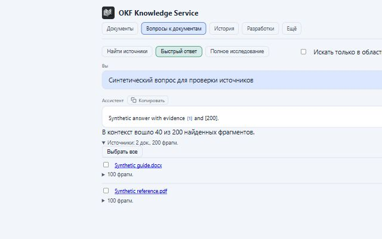

# UX-изменения: реализация и проверка 06.10.2026

## Результат

Реализованы T1–T8 согласованного плана. Изменения подготовлены в worktree `codex/project-ux-improvements` и по запросу пользователя перенесены в рабочую копию `main` (`C:/Users/alexey/ai-workspace/ai-knowledge`). Посторонние изменения сохранены. Commit базы: `47d5d410696ca1bba8d8adcc2529a220eaab8803`. Этот раздел фиксирует состояние до запрошенного локального коммита; push не выполнялся. Локальный dev frontend использует перенесённые файлы; production-развёртывание не выполнялось.

- Источники больше не показывают score как процент; полный набор, исходные цитаты и различие найденного/переданного модели сохранены.
- Список документов и история различают загрузку, обновление, ошибку, пустую базу и пустую отфильтрованную выдачу; ошибки содержат восстановление и безопасный код обращения.
- Вопрос вводится в textarea: Enter отправляет, Shift+Enter добавляет строку, IME учитывается. Черновик живёт в контексте владельца; повтор использует исходные параметры, редактирование защищает другой черновик.
- URL выбирает вкладку документов и переписку; активный пункт навигации единственный. Viewer получает список вместо недоступной вкладки загрузки.
- Уведомления имеют отдельное закрытие, live role и паузу таймера при фокусе/наведении; ошибки по умолчанию постоянные.
- Пакет загрузки живёт в провайдере приложения. По каждому файлу сохраняется результат; повтор отправляет только неудачные/неопределённые/неотправленные элементы. Принятие файла отделено от серверной обработки.
- Фильтры поиска свёрнуты, действующие ограничения видны и снимаются отдельно. Примеры заполняют поле без отправки.
- Источники сгруппированы по документам, закрытые группы не монтируют строки. Выбор сохраняет полный набор; действия появляются при выборе. Раскрытие группы сохраняется в сообщении.

## Автоматические проверки

| Проверка | Результат |
|---|---|
| Baseline `node --test` | 371 passed, 1 skipped, 0 failures |
| Финальный `node --test` | 391 passed, 1 skipped, 0 failures; exit 0 |
| `node node_modules/eslint/bin/eslint.js .` | 0 errors, 37 warnings; exit 0; количество предупреждений соответствует baseline |
| `node node_modules/next/dist/bin/next build --webpack` | PASS, exit 0 |
| `git diff --check` | PASS, exit 0; Git предупреждает о штатном LF/CRLF для JSON |
| Локализация | RU/EN и сгенерированные ui_keys.json/ui_en.json: 1277 ключей |
| Независимое финальное ревью | Все Important устранены и повторно проверены; Critical не обнаружены |

Новые содержательные регрессии покрывают приоритет состояний, debounce и scope выбора, legacy-нумерацию, сохранение раскрытия, snapshot восстановления, взаимоисключение source_selection/search_doc_ids, пакетные исходы и смену владельца во время согласия на похожий файл.

## Браузерная проверка

Окружение: отдельная production-сборка Next.js на 16301, локальный синтетический HTTP API на 18001, Codex IAB. Настоящие документы/LLM/БД не использовались. Основной UI на 16300 при исходном аудите не был доступен. Перед финалом временные процессы и вкладка остановлены.

| Сценарий | Фактически наблюдалось |
|---|---|
| Многострочный вопрос | Shift+Enter добавляет строку, textarea растёт; Enter отправляет |
| Черновик → документы → чат | Введённый текст сохраняется и отправляется после возврата |
| HTTP 503 → повтор | Безопасная ошибка с кодом обращения и кнопкой; повтор даёт ответ |
| 200 источников | 2 документа, 200 фрагментов; 40 в контексте, остальные доступны; выбор всех включает 200; глобальные номера 1/3/5 и 2/4/6 |
| Недоступный snapshot | Понятное объяснение и действие «Найти источники заново»; новый поиск выполняется |
| История | URL `?session=fixture-session`, reload восстанавливает переписку; Back/Forward возвращают список/переписку; активен только /chat/history |
| Фильтр без результатов | Явное сообщение и «Сбросить все» |
| Ошибка списка | Постоянное сообщение, код обращения, «Повторить»; нет имитации пустой базы |
| Операция A → фильтр B → позднее завершение A | Новая пустая выдача B остаётся доступным актуальным состоянием; бесконечное refreshing не воспроизвелось |
| Загрузка → чат → загрузка | Первый файл принят; 507 storage_full у второго; третий не отправлен. Итог переживает переход |
| Повтор неудачных | Принятый файл сохраняет docId; повтор обновляет лишь неудачные исходы |
| Выход → viewer | Результаты другого владельца отсутствуют; /?view=upload показывает разрешённый список |
| Editor/admin/viewer | Права отображения проверены на синтетических ролях; серверную авторизацию эта проверка не доказывает |
| Ошибка toast → Enter на закрытии | Уведомление закрывается; фокус переходит в контейнер уведомлений |
| RU/EN, темы | Новые элементы переключаются на английский; проверены светлая и тёмная темы |
| Адаптивность | В чате на фактических CSS-ширинах 360/768/1440 px scrollWidth === innerWidth. На 360 px также проверены список, раскрытые фильтры и результаты загрузки |

Снимок светлой темы с синтетическим ответом:

## Открытые проверки и ограничения

- Production-приёмка на реальном backend/корпусе, реальном SSO и потоке LLM остаётся OPEN. Синтетический API проверяет клиентские переходы, а не качество поиска/обработки.
- Полная матрица 200% browser zoom, настоящий ввод IME, screen reader, все клавиатурные переходы, hover/focus таймеров и hard-reload warning не подтверждена вручную. Для соответствующей логики есть целевые автоматические проверки и статическое ревью.
- Диалог похожего файла/неопределённый сетевой результат/смена владельца во время передачи проверены runner-тестами; браузерный пакет использовал success/storage_full/not-sent.
- Парного измерения производительности до/после нет: исходный стек был недоступен. 200 источников проверены браузером, 500 — тестом полноты. Ускорение в миллисекундах не заявляется.
- Нет восстановления File после закрытия браузера; приватное состояние существует только в памяти. Перед откатом провайдера следует завершить активную передачу.

Изменения не требуют миграции БД или переиндексации. Поиск, score API и backend-контракты не изменены; изменения backend ограничены generated i18n manifests.

## Перенос в основную рабочую копию

По явному запросу пользователя перенесены 47 файлов в рабочее дерево ветки `main` без создания коммита. Исходные файлы сохранены в локальной резервной копии `C:/Users/alexey/AppData/Local/Temp/ux-main-transfer-opuxnq2a`; manifest содержит точный список переноса и контрольные суммы. Сохранность 55 посторонних файлов проверена по SHA-256. Дополнения пользователя в SECURITY.md сохранены побайтно как исходный префикс; добавлен только раздел UX.

В основном каталоге `node --test`: 391 passed / 1 skipped / 0 failures; lint: 0 errors / 37 прежних warnings. Полная пересборка в активном `.next` не запускалась, чтобы не нарушить работающий dev server. Production-сборка идентичных frontend-файлов прошла ранее в изолированном worktree.

На действующем `http://localhost:16300/chat` браузер подтвердил новую textarea «Вопрос по базе знаний», подсказку Enter/Shift+Enter, примеры вопросов и компактную сводку фильтров поиска. Вход/контур/данные не изменялись, запрос к LLM не отправлялся. Для уже открытой пользовательской страницы требуется обновление, чтобы заново загрузить изменённый корневой layout/provider. Это smoke-проверка загрузки новой версии UI, не полная production-приёмка из раздела ограничений выше.

## Терминология и проверка перед коммитом

По замечанию пользователя новый блок переименован в «Фильтры поиска» / «Search filters» (`ux.searchFilters`). «Область поиска» сохраняет существующее значение — перечень выбранных документов. Заголовок и доступное имя сводки проверены на действующем UI; locale manifests обновлены.

Перед локальным UX-коммитом от 06.10.2026: frontend tests 391 PASS / 1 SKIP / 0 FAIL; ESLint 0 errors / 37 прежних warnings; backend Ruff PASS. `node scripts/check-project.mjs` выполнен, но завершился на npm audit: 7 high severity vulnerabilities в существующем lockfile. package.json/package-lock.json совпадают с HEAD и данным изменением не затронуты. Последующие lint/tests/Ruff выполнены отдельно; полный project gate остаётся FAILED, а не PASS. Зависимости не обновлялись в рамках UX-коммита.
