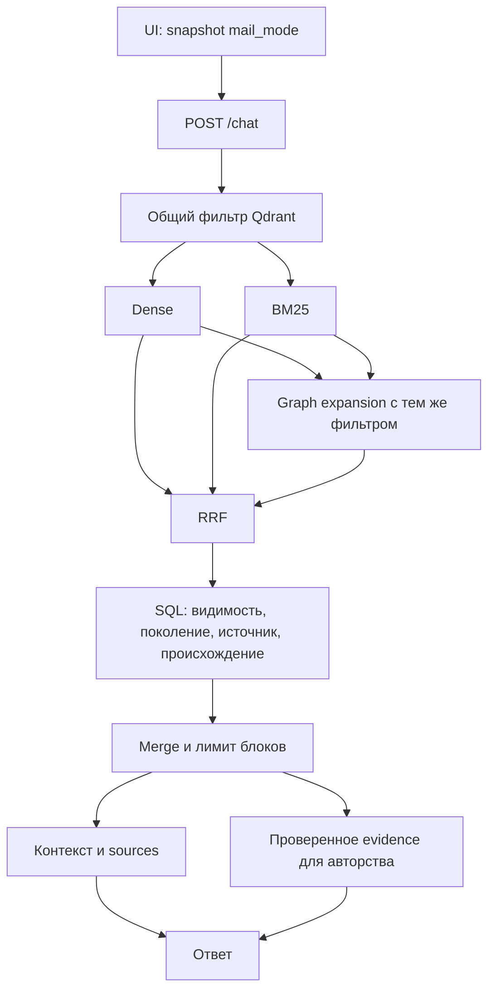

# Фильтр писем в чате — техническая спецификация

**Дата:** 27.09.2026.
**Статус:** спецификация для ревью; реализация, изменение данных и включение функции не выполнены.
**Исходный план:** [2026-09-26-chat-mail-filter.md](../plans/2026-09-26-chat-mail-filter.md).
**Связанная спецификация:** [импорт Outlook и дерево источников](2026-09-25-outlook-mail-ingestion-design.md).

Требования ниже уточняют исходный план с учётом прочитанного кода на 27.09.2026. Названия предлагаемых интерфейсов и файлов не означают, что они уже реализованы. Живые БД, полнота происхождения текущего корпуса и Qdrant в рамках подготовки документа не проверялись.

## 1. Назначение и границы

Пользователь выбирает, учитывать ли письма при ответе чата. Основное согласованное правило: **«всё, что внутри письма, считаем частью письма»**. Оно действует для самостоятельного письма, письма внутри документа/таблицы и всех потомков письма.

Единица классификации — источник внутри документа, идентифицированный парой `(doc_id, source_id)`. Весь загруженный файл нельзя классифицировать по одному вложенному письму. Фильтруются источники фактов для нового ответа, а не ранее сохранённые ответы или доступ пользователя к просмотру файлов.

В объём входят API чата, поисковый pre-filter, каноническая проверка результатов, все дополнительные чтения текста для ответа, запись payload при индексации, обновление существующих payload, UI, локализация, диагностика и приёмка двух контуров.

За пределами задачи: импорт почтового ящика, новые парсеры, OCR, изменение эмбеддингов/BM25, генерация концептов, автоматический ремонт старого происхождения, фильтр обычного `/search`, фильтрация списка документов и долговременное сохранение предпочтения. Новые внешние зависимости и SQL-колонки для `mail_scope` не требуются.

## 2. Семантика режимов

| UI, RU | API `mail_mode` | Допустимое каноническое происхождение |
|---|---|---|
| С учётом писем | `all` | `document`, `mail`, `unknown` |
| Без писем | `exclude` | только `document` |
| Только письма | `only` | только `mail` |

`all` — значение по умолчанию, в том числе для старого клиента без нового поля. Фильтр не изменяет веса ранжирования и не означает «предпочитать письма».

**Решение D-01, подтверждено пользователем 27.09.2026:** `unknown` исключается из обоих строгих режимов и остаётся доступным только в `all`. Таблица, pre-filter, постпроверка, UI и тесты ниже фиксируют эту согласованную политику.

```text
root: DOCX                       document
├─ root/0: обычный PDF            document
└─ root/1: письмо                mail
   ├─ root/1/0: DOCX             mail
   │  └─ root/1/0/0: PDF         mail
   └─ root/1/1: вложенное письмо mail
      └─ root/1/1/0: XLSX        mail
```

Корневое MSG/EML и вся его ветка — `mail`. Обычное вложение рядом с письмом — `document`. Расположение письма в ячейке таблицы не влияет на правило. Одинаковый PDF, отдельно загруженный и приложенный к письму, имеет разную принадлежность в этих двух местах.

Классификация не зависит от имени/расширения, тегов `mail`/`attachment`/`review`, содержимого, отправителя, языка, LLM, `artifact_kind` или `container_source_id`. Последний используется для доступа к артефакту; семантическое родительство задаёт только `parent_source_id`.

Текст письма, вручную скопированный в обычный документ без отдельного источника, остаётся текстом документа. Фильтр не распознаёт скрытое почтовое происхождение по содержимому и не является механизмом разграничения доступа.

## 3. Подтверждённое состояние кода

| Область | Существующий механизм | Следствие для реализации |
|---|---|---|
| `db/models.py` | `DocumentSource` имеет составной ключ; `DocumentChunk` и `OkfConcept` содержат `source_id` | Нельзя кэшировать происхождение только по `source_id` |
| `source_store.py` | `fetch_source_paths` читает источники в переданной сессии; письмо определяется `kind == "mail"` или `metadata.mail is True` | Использовать то же строгое правило, без truthiness строк |
| `source_store.py` | Публичный путь имеет allowlist метаданных и защиту обхода на 32 узла | Не использовать отсутствие отображаемого пути как единственное доказательство происхождения |
| `vector_store.py` | Общий фильтр dense/BM25; `generation_exclusions`; slim payload selector | Добавить поля происхождения в запись и selector |
| `vector_store.py` | `_graph_expansion` сейчас переносит только `must_not` из фильтра без тегов/языка | Передавать полный поисковый фильтр, иначе граф обходит ограничения |
| `retrieval_hydration.py` | Видимость, active generation и тексты читаются в согласованной SQL-сессии; входные `source_id`, `source_path`, `mail_fragment` удаляются | Выполнять проверку происхождения в той же сессии |
| `retrieval_hydration.py` | Оптимизация не загружает некоторые чанки многотемной группы | Пропуск текста не должен пропускать чтение идентичности и проверку происхождения |
| `context_builder.py` | Merge по `(doc_id, chunk_index)`, primary и сиблинги; дополнительный `mail_fragment` | Защитить каждый компонент блока, а не только primary |
| `authorship_evidence.py` | Для вопросов об авторстве повторно читает SQL-чанки в новой сессии | Повторно проверить поколение и режим перед использованием текста |
| `pipeline.py` | Индексация candidate выполняется до публикации `source_rows`, chunks и concepts в канонические таблицы | Нельзя классифицировать candidate по старому опубликованному дереву |
| `canonical_reindex.py`, `canonical_repair.py` | Отдельные пути записи точек | Они также обязаны писать актуальный mail payload |
| `ChatPanel.jsx` | Обычная отправка и отдельный повтор без словаря | В обоих вызовах фиксировать и сохранять `mail_mode` |
| `ChatContext.js` | Состояние фильтров живёт в provider; новый чат очищает сообщения и session ID | Новый режим следует этому жизненному циклу |

Эти наблюдения получены чтением кода, а не запуском приёмочных тестов.

## 4. Архитектурное решение

Выбран вариант **каноническая классификация → производный payload → pre-filter → каноническая проверка**.

1. Каноническое дерево определяет принадлежность источника.
2. При индексации каждой concept/chunk-точки записывается вычисленный признак.
3. Qdrant применяет режим до ограничения числа кандидатов во всех ветках.
4. Backend сверяет выбранные точки с опубликованными SQL-данными до merge.
5. Сборка контекста и дополнительные загрузки используют только прошедшие проверку источники.

Только постфильтрация непригодна: первые 40 кандидатов могут быть письмами, а нужный обычный документ окажется за пределами выборки. Только payload недостаточен: он может устареть после ремонта/публикации. Передача всех разрешённых SQL source ID в каждый запрос Qdrant усложняет запросы на больших корпусах и не нужна при выбранной схеме.



## 5. Классификатор происхождения

Новый модуль: `backend/app/services/mail_scope.py`. Чистая логика не обращается к БД, Qdrant, файловой системе или LLM.

```python
MailScope = Literal["mail", "document", "unknown"]
MailMode = Literal["all", "exclude", "only"]

def classify_mail_scope(source_id: str | None, sources: list[dict]) -> MailScope: ...
def build_mail_scope_map(sources: list[dict]) -> dict[str, MailScope]: ...
def mail_scope_allowed(scope: MailScope, mail_mode: MailMode) -> bool: ...
```

`sources` принадлежит ровно одному документу и одному снимку поколения. Нормализованные элементы содержат `source_id`, `parent_source_id`, `kind`, `metadata`; ORM-адаптер преобразует `metadata_json` в `metadata`. Если batch содержит несколько документов, внешний словарь ключуется по `doc_id`. Смешивание деревьев запрещено.

Алгоритм для одного источника:

1. `source_id is None`, пустой ID или неизвестный ID → `unknown`.
2. Проверить уникальность ID дерева и существование единственного `root` с `parent_source_id is None`. Дубли ID или некорректный root делают дерево неоднозначным: все результаты `unknown`.
3. Итеративно пройти цепочку до `root`, отслеживая посещённые ID. Цикл, отсутствующий родитель, пустой родитель не-root или завершение не на root → `unknown` для затронутой цепочки.
4. Только после проверки **всей** цепочки: если хотя бы один её узел имеет `kind == "mail"` или `metadata.get("mail") is True`, вернуть `mail`; иначе `document`.
5. При неправильном типе metadata использовать пустой объект. Строки `"true"`, числа `1`, имена файлов `.msg` и похожие теги не являются булевым флагом письма.

Даже если mail-узел встретился до обнаружения цикла, результат — `unknown`. Повреждённая отдельная ветка не обесценивает соседнюю исправную цепочку. Отсутствие метаданных не мешает `kind == "mail"`.

Производственный batch использует `build_mail_scope_map` с мемоизацией: время O(S), память O(S), где S — количество узлов дерева. Нельзя выполнять O(P × S) полных обходов для P точек одного документа. Рекурсивный Python-обход не нужен. Дополнительного фиксированного ограничения глубины классификатор не вводит; глубину импорта регулирует парсер. Обход всегда ограничен конечным числом узлов и обнаружением циклов.

### 5.1. Связь классификации с текстом точки

Для концепта источник берётся из канонического `OkfConcept.source_id`, для чанка — из `DocumentChunk.source_id`. При индексации candidate используются соответствующие подготовленные записи будущей публикации.

Концепт с `source_id=None` не наследует источник чанка автоматически. Если концепт ссылается на существующий чанк, но их непустые `source_id` различаются, это диагностируемое нарушение происхождения; такой концепт получает `unknown` для строгого поиска. Канонический `chunk_index` концепта восстанавливается из SQL перед группировкой, а не принимается без проверки из payload.

Старый плоский чанк без source ID — `unknown`. Один лишь корректный root не доказывает, что старый текст не склеен из нескольких источников. Известные смешанные/неподтверждённые старые привязки должны быть отражены в аудите; их нельзя автоматически повышать до `document`. Функция фильтра не способна доказать однородность произвольного текста: для включения строгих режимов требуется подтверждённая provenance-схема корпуса либо отдельный ремонт таких данных.

## 6. Payload и пути индексации

Каждая записываемая concept/chunk-точка получает:

```json
{"mail_scope": "mail", "mail_scope_version": 1}
```

`mail_scope_version` — версия алгоритма, не версия документа. Отсутствующий/невалидный scope, отсутствующая версия или версия не равная 1 считаются неизвестным производным признаком и не проходят строгий pre-filter. `all` игнорирует эти поля.

Добавить в `PAYLOAD_INDEX_FIELDS`: `mail_scope: keyword`, `mail_scope_version: integer`. Добавить оба поля в `RETRIEVAL_PAYLOAD_FIELDS` для сравнения с SQL и диагностики. Проверять фактическую схему индексов; существующий `_ensure_payload_indexes`, подавляющий исключения, сам по себе не доказывает успешную миграцию.

Предлагаемое расширение `VectorStore.index_concepts` и `index_chunks`: keyword-only `mail_scopes: list[MailScope] | None = None`. Список соответствует порядку `okf_docs` либо `chunk_texts` конкретного `doc_id`/поколения; его длина должна точно совпадать с числом записей, иначе ValueError до первого upsert. Отсутствующий список означает `unknown` для каждой точки, а не `document`. Вызывающий код строит список из `build_mail_scope_map` и канонических source ID. Проверка согласованности концепта и чанка выполняется до записи: для недоказанного концепта в его позиции передаётся unknown, не меняя классификацию остальных записей того же источника. Входное `metadata.mail_scope` из OKF/LLM игнорируется.

| Путь | Откуда брать дерево |
|---|---|
| Новая загрузка, resume, regenerate в `pipeline.py` | `source_rows` того же candidate, что `chunk_rows` и `okf_docs` |
| Публикация готового candidate | Проверенный `publication.json`, его sources/chunks/concepts |
| `canonical_reindex.py` | SQL-дерево внутри существующего `lock_generation_read` |
| `canonical_repair.py` | `proposal["sources"]` ремонтируемого candidate |
| Metadata-only backfill | SQL-дерево только активного поколения |
| Fixture/старый вызов без доказанного дерева | Явный `unknown` |

Все прямые вызовы `index_concepts`/`index_chunks` должны быть инвентаризированы. Reindex может пересчитывать векторы по своему назначению, но миграция этой функции reindex не вызывает.

### 6.1. Публикация и конкуренция

Новый payload должен существовать до переключения active generation. Для старого готового candidate, созданного до обновления, публикация обязана привести эти два поля к версии 1 из проверенного publication manifest, не вычисляя эмбеддинги. Если `sources is None` означает сохранение дерева, использовать именно сохраняемое дерево под блокировкой публикации; при отсутствии доказанного дерева записать unknown. При ошибке обновления payload публикация не переключает active pointer; candidate остаётся доступным для штатного повторного завершения.

Нельзя читать опубликованный SQL root во время индексации нового candidate: ID `root/0` может остаться тем же, а его происхождение измениться. SQL-lock при гидратации, выбор поколения и проверка происхождения должны находиться в одном согласованном снимке. Длительный общий cache происхождения без ключа поколения запрещён; достаточно cache в рамках операции.

Изменение тегов, языка, разработки и deleted-флага должно сохранять новые поля. Полные upsert при восстановлении/переиндексации обязаны вычислять их заново. Ни backfill, ни новый режим не меняют active generation, point ID, slug, chunk index, координаты источников или векторы.

## 7. API и серверный поиск

### 7.1. Публичный контракт

В `ChatRequest` добавить:

```python
mail_mode: Literal["all", "exclude", "only"] = "all"
```

Пример тела `POST /chat`:

```json
{
  "query": "Как согласуется изменение графика?",
  "locale": "ru",
  "tags": [],
  "top_k": 10,
  "mode": "hybrid",
  "mail_mode": "exclude",
  "use_glossary": true,
  "source_locales": ["ru"],
  "include_unknown_source_locale": false
}
```

Неизвестная строка, `null`, число, массив и boolean → штатный 422 Pydantic до embedding/search/LLM. Регистр значим; `ONLY` не принимается. `mail_mode` не заменяет `mode` (`dense`/`bm25`/`hybrid`) и не выводится из query или session ID.

`ChatResponse` и `ChatSource` не требуют новых публичных полей. Существующий `retrieval_metadata` записи истории можно дополнить `mail_mode` как необязательным полем схемы v1; старое отсутствие означает `all`. Это аудит запроса, а не сохранение пользовательского предпочтения. Старые сообщения не переписываются.

### 7.2. Внутренние интерфейсы

| Функция | Изменение контракта |
|---|---|
| `VectorStore.search_composite` | keyword `mail_mode: MailMode = "all"` |
| `VectorStore._build_search_filter` | keyword `mail_mode: MailMode = "all"`; существующие аргументы сохраняются |
| `VectorStore._graph_expansion` | обязательный keyword `search_filter: qm.Filter` |
| `load_visible_retrieval_hits` | keyword `mail_mode: MailMode = "all"` |
| `merge_and_format` | keyword `mail_mode: MailMode = "all"` для строгой группировки и проверок |
| `answer_authorship`, `load_authorship_evidence` | keyword `mail_mode: MailMode = "all"`; проверка поколения по внутренним данным блока |

Все текущие вызовы вне чата сохраняют `all`. Внутренний неизвестный режим вызывает явную ошибку, а не тихий fallback.

### 7.3. Qdrant pre-filter

`all`: не добавлять условий mail. `exclude`: добавить в `must` условия `mail_scope == "document"` **и** `mail_scope_version == 1`. `only`: аналогично со значением `"mail"`. Нельзя реализовывать exclude как `must_not mail`, поскольку это пропустит отсутствующий payload.

Условие mail соединяется через AND с прежними условиями тегов/dev_tags, языка, корзины и поколений. Внутренняя OR-семантика существующих tag/locale фильтров не меняется. Unknown-язык и unknown-происхождение независимы.

Один общий фильтр передаётся dense, BM25 и графовому расширению. Для графа использовать вложенный `Filter(must=[search_filter, slug_condition])`, не вынимая отдельные поля и не теряя вложенные OR. Graph scroll фильтруется до своего limit. Расширение словарём изменяет поисковый текст, но не режим и не фильтры.

`top_k` ответа остаётся числом блоков после merge. Существующие лимиты кандидатов и RRF-веса сохраняются. После канонической проверки допускается меньше `top_k` результатов; бесконечного добора и повторного поиска в `all` нет.

**Уточнение совместимости:** при `mail_mode=all` mail-фильтр не меняет результат. Исправление графовой ветки может отдельно убрать результаты, которые раньше обходили заданные tags/locale; это ожидаемое исправление из требования AND, а не эффект mail-фильтра. Для запроса без ограничений тегов/языка baseline `all` должен совпадать с прежним.

### 7.4. Каноническая постпроверка

Внутри текущей SQL-сессии `load_visible_retrieval_hits`:

1. Проверить существование документа, удаление и активное поколение существующим механизмом.
2. Пакетно загрузить канонические identities концептов и чанков. Метаданные нужны и для чанков, текст которых пропускает оптимизация `_chunk_pairs_needed_for_merge`.
3. Загрузить raw-деревья этих документов, вычислить scope и проверить согласованность concept/chunk. Не доверять входным `source_id`, scope, path или fragment из Qdrant.
4. В строгом режиме исключить противоположный scope, unknown и отсутствие канонической записи. Сравнить производный payload с канонической классификацией для диагностики.
5. Гидрировать текст, разрешённые пути и фрагменты только для оставшихся точек; выполнить существующие exact-match проверки.

Неправильный payload, ошибочно пропустивший письмо в exclude, отсекается SQL. Обратный рассинхрон — нужная точка не прошла pre-filter — невозможно исправить постпроверкой: это потеря полноты до ремонта индекса, которую выявляет backfill-аудит. Автоматического ослабления режима нет.

При недоступной БД строгий ответ не строится по payload: применяется штатная ошибка зависимости. При пустом разрешённом результате — HTTP 200, `sources: []`, локализованный ответ без вызова генерации ответа LLM. Отсутствие LLM здесь не означает отсутствие embedding-вызова, если запрос использовал dense.

## 8. Сборка контекста и дополнительные источники

В строгих режимах группировать по `(doc_id, chunk_index, source_id)`, чтобы несовместимые source ID не склеивались. Для `all` сохраняется прежняя группировка. В исправных данных результат группировки совпадает; при повреждённых идентичностях приоритет имеет изоляция источников.

Каждый сиблинг проходит ту же проверку, включая `kind=review`. Освобождение замечаний от лексического anti-noise фильтра не освобождает их от проверки происхождения. Нельзя подмешать отброшенный чанк к разрешённому концепту после фильтрации, заново загрузить все концепты группы или брать union-теги из отброшенных точек.

Внутри hit/merged сохранить канонический `mail_scope` и поколение документа для последующих проверок; эти служебные значения не выводить пользователю и не включать в инструкции модели. Проверка всех компонентов происходит до окончательной нумерации ссылок; `sources[N]` и блок `[N+1]` должны относиться к одному разрешённому источнику.

| Компонент | `exclude` | `only` |
|---|---|---|
| Основной текст и snippet | Только document | Только mail |
| Сиблинги/review | Только document | Только mail |
| `mail_fragment` | Отсутствует | Только канонический текст того же разрешённого источника и поколения |
| `source_path` | Проверенный путь без mail-узлов | Допустим полный allowlist-путь, включая внешний обычный контейнер |
| Текст родителя/соседа | Не загружается дополнительно | Не загружается дополнительно |

Название внешнего DOCX в `source_path` письма допустимо в only: это путь навигации, не содержимое DOCX. Вложение письма считается mail, но это не разрешает подставлять текст родительского письма вместо текста вложения. Существующий allowlist метаданных сохраняется; полный metadata JSON не передаётся в prompt/sources.

Защитный финальный контроль строгого блока проверяет scope и согласованность его компонент. При нарушении блок целиком исключается с диагностикой, без частичного вырезания предложений по эвристике. После удаления блоков повторно определить пустой результат и нумерацию источников.

### 8.1. Вопросы об авторстве

`load_authorship_evidence` в строгом режиме получает режим и каноническое поколение каждого разрешённого блока. В новой сессии использует `lock_generation_read`, повторно проверяет видимость, активное поколение, natural key и source ID, затем классифицирует источник в том же снимке. Если поколение сменилось, источник исчез или сменил принадлежность, evidence этого блока отбрасывается. Текст предка не подставляется.

Блокировка освобождается до LLM-вызова. Если evidence отсутствует, используется штатный ответ об отсутствии подтверждённого авторства; расширения до all нет. Номера evidence продолжают ссылаться на исходные разрешённые блоки. Отдельный тест должен доказать отсутствие запрещённого маркера именно в запросе LLM для авторства.

### 8.2. Ограничения гарантии

Гарантия относится к отбору источников и отправленному контексту, а не к запрету модели произносить слово «письмо» или повторять почтовый текст из вопроса пользователя. Старые ответы в истории остаются видимыми. Пользователь может открыть целый документ по разрешённой ссылке и увидеть другие ветки в viewer — mail-режим не меняет права просмотра.

## 9. UI и локализация

В существующей строке фильтров `ChatPanel` добавить один select «Источники» с тремя вариантами из §2. Начальное значение `all`; control доступен с клавиатуры, имеет видимую подпись/accessible name и связанную подсказку. При узком экране не должен создавать горизонтальный overflow.

Состояние `mailMode`/`setMailMode` находится в `ChatContext`. Переходы внутри существующего provider и «Новый чат» сохраняют выбор аналогично поисковому режиму. Полная перезагрузка/provider remount возвращает `all`. LocalStorage/cookie и запись предпочтения в БД не добавляются. Открытие старой истории не меняет текущий выбор.

Предлагаемая совместимая сигнатура API helper:

```javascript
chat(query, tags = [], topK = 5, mode = "hybrid", sessionId = null,
     sourceLocale = "", useGlossary = true, mailMode = "all")
```

Helper всегда сериализует `mail_mode`. При отправке ChatPanel сохраняет snapshot `requestMailMode` вместе с остальными параметрами сообщения до await. Смена select во время pending влияет только на следующую отправку. Уже показанные ответы не перезапрашиваются.

«Повторить без словаря» использует `message.requestMailMode`, а не текущее значение select. Для старых сообщений без поля — `all`, поскольку так выполнялся старый запрос. После повтора snapshot сохраняется и у нового результата; на ошибке не теряется. Новая обычная отправка всегда использует текущий выбор.

| Ключ | RU | EN |
|---|---|---|
| `chat.mailModeLabel` | Источники | Sources |
| `chat.mailModeAll` | С учётом писем | Include emails |
| `chat.mailModeExclude` | Без писем | Exclude emails |
| `chat.mailModeOnly` | Только письма | Emails only |
| `chat.mailModeHint` | Вложения писем также относятся к письмам. | Email attachments are also treated as emails. |
| `chat.mailModeUnknownHint` | Источники с неопределённым происхождением доступны только в режиме «С учётом писем». | Sources of unknown origin are available only in “Include emails” mode. |
| `chat.noSourcesMailFilter` | Источники не найдены с учётом выбранных фильтров. Измените фильтры и повторите запрос. | No sources match the selected filters. Change the filters and try again. |

Общая подсказка видна всегда; unknown-подсказка — в строгих режимах согласно D-01. В строгом режиме при пустом результате использовать новый текст; в all — прежний `chat.noSources`. UI не должен представлять пустой результат как доказательство отсутствия документов в базе или автоматически переключать режим.

Ключи синхронно добавить в `frontend/src/i18n/locales/ru.js`, `en.js`, `backend/app/i18n/ui_keys.json`, `ui_en.json`. Серверный пустой ответ следует `req.locale`; технические термины Qdrant/payload/generation в UI не показываются.

## 10. Миграция существующих точек

Новый скрипт `backend/scripts/backfill_mail_scope.py` выполняет только patch двух служебных полей по конкретным ID точек. Не использовать replace/clear всего payload, upsert векторов, генерацию, `ensure_chunks` или перепарсинг.

### 10.1. CLI

| Аргумент | Контракт |
|---|---|
| `--dry-run` | Чтение и отчёт; поведение по умолчанию при отсутствии обоих режимов |
| `--apply` | Запись изменений; несовместим с `--dry-run` |
| `--batch-size N` | 1..1000, default 256; размер страницы/батча обновления |
| `--doc-id ID` | Ограничить обработку одним документом |

Используется штатный `get_settings` текущего процесса. Отдельного неявного переключения контура нет. Перед запуском задать env того же backend: как минимум корректные `DATABASE_URL`, `QDRANT_URL`, `QDRANT_COLLECTION`, `KNOWLEDGE_PROFILE`. Корневой `.env` не является production-конфигурацией; переменные выбранного runtime env передаются процессу штатным запуском/Compose. Значения секретов не печатать.

Для каждого запуска фиксировать безопасный идентификатор контура, имя коллекции, обезличенный идентификатор БД, версию алгоритма и время. При недоступной/отсутствующей коллекции завершаться с ошибкой; dry-run не создаёт коллекцию, индексы, таблицы или точки.

### 10.2. Порядок обработки

1. Перед apply остановить writers соответствующего контура: загрузку/очередь, resume/regenerate, reindex, публикацию, purge и фоновые repair/backfill. Read-only чат может работать. Это контролируемое окно обслуживания, не обещание атомарной миграции всего индекса.
2. Scroll Qdrant с `with_vectors=False` и минимальными identity/mail полями; необязательный doc-id фильтр применяется на сервере. Не загружать весь корпус в память.
3. Пакетно определить документы и active generation, взять штатную блокировку чтения при обработке документа. Legacy `generation_id=None` допустим только если active generation также отсутствует.
4. Для активных точек сопоставить concept по `(doc_id, slug)`, chunk по `(doc_id, chunk_index)` с SQL. Получить дерево, проверить source IDs и вычислить ожидаемый scope.
5. Точки без документа/канонической строки или с некорректной identity получают ожидаемый `unknown`. Отдельно считать такие причины. Не восстанавливать запись БД из payload.
6. Неактивные/подготовленные/старые поколения учитывать как `skipped_nonactive`; не классифицировать их по активному дереву. Новый writer и путь публикации обеспечивают их корректность при будущем включении.
7. Для изменившихся активных/orphan-точек сгруппировать конкретные point IDs по scope, выполнить `set_payload({mail_scope, mail_scope_version: 1}, wait=True)`. Корзину можно классифицировать, сохраняя deleted; по-прежнему исключать её из поиска.
8. В apply создать/проверить payload indexes. Ошибка индекса — ошибка выполнения, а не подавленное предупреждение. Readback изменённых батчей проверяет оба поля. Не найденные при readback точки отмечаются как конкурентное изменение/ошибка.
9. После apply повторить dry-run в том же окне обслуживания. На неизменном наборе активных точек `would_change=0`, успешность индексов подтверждена.

Сетевые сбои/429/5xx: до 3 попыток с ограниченной задержкой по существующему подходу vector store; 4xx валидации без повторов. Ошибка батча сохраняется в отчёте, остальные независимые батчи могут продолжить. Возврат 0 — завершённый проход без операционных ошибок; 1 — частичный сбой/ошибка выполнения; 2 — неправильные аргументы. Наличие unknown само по себе не является операционным сбоем и не означает готовность строгих режимов.

Повтор apply идемпотентен. После прерывания можно повторить проход с начала: уже совпадающие точки не записываются. Resume-файл/checkpoint не требуется. Если writers нельзя остановить, apply не допускается данным регламентом: нужен отдельно спроектированный online backfill.

### 10.3. Отчёт и проверка целостности

Отчёт содержит `scanned`, `active`, `skipped_nonactive`, `mail`, `document`, `unknown`, `would_change`, `updated`, `unchanged`, `orphan`, `missing_canonical`, `invalid_identity`, `broken_tree`, `failed_batches`, число readback-ошибок; отдельно concept/chunk и причины unknown. Категории причин могут пересекаться, а scope-категории активных классифицированных точек — нет. Нужен также счётчик канонических записей без активной точки, чтобы частично отсутствующий индекс не выглядел полностью исправным.

В тестах и на выделенной приёмочной коллекции сравнить до/после: point IDs, количество точек, плотные/разреженные векторы и весь payload за вычетом двух полей. Для реального корпуса сохранить контрольные выборки и агрегаты. Читать векторы для проверки допустимо; сам backfill их не запрашивает и не записывает.

Основной и измерительный контуры обрабатываются отдельными процессами с отдельными отчётами. Перед каждой записью сверить целевой профиль, БД и коллекцию; нельзя предполагать одинаковые doc IDs или копировать payload между контурами. Конкретные имена измерительной БД/коллекции устанавливаются из её действующей конфигурации при внедрении.

## 11. Диагностика и производительность

Для строгих запросов добавить структурированное событие `chat_mail_scope_filter`: режим, число кандидатов/допущенных/отброшенных, причины unknown, число расхождений payload с SQL, время классификации. Для backfill — `mail_scope_backfill` с указанными агрегатами и результатом батча. Не писать query, текст, тему/адреса письма, metadata, DSN, API keys или полный payload. В закрытом техническом отчёте допустимы внутренние doc/point ID для ремонта.

Диагностика является сигналом ремонта, а не механизмом записи в индекс из пользовательского GET/POST поиска. Если рассинхрон не наблюдался среди возвращённых хитов, это не доказывает полноту индекса: нужен backfill-аудит.

Не допускаются SQL-запрос на каждую точку, запрос LLM для классификации, дополнительный embedding или полный scroll на запрос чата. Дополнительное чтение деревьев выполняется batch по уникальным документам с cache на время операции. Metadata чанков читается независимо от оптимизации больших текстов. Максимальные размеры контекста сохраняются.

Для измерений: одинаковые корпус, индексы, настройки, 10 прогревочных и 100 измерительных retrieval-прогонов без генерации ответа, фиксированное чередование режимов. Зафиксировать p50/p95, SQL query count, число кандидатов и размер контекста. Предлагаемый порог приёмки накладных расходов классификации/гидратации: p95 прироста не более `max(50 мс, 20% baseline retrieval p95)` на одном стенде; превышение требует профилирования и решения перед выпуском. Это целевой бюджет, не результат измерения.

## 12. Матрица тестов

Каждый тест на отсутствие запрещённого текста проверяет не только список sources, но и фактические аргументы LLM/ветки авторства. Синтетические источники получают уникальные маркеры, не присутствующие в вопросе и других источниках.

| ID | Сценарий | Проверяемый результат |
|---|---|---|
| C01 | Обычный root без вложений | document |
| C02 | Root mail по kind; отдельно по boolean metadata | mail обоими способами |
| C03 | DOCX → mail → DOCX → PDF/mail | Наследование только вниз; обычный сосед document |
| C04 | Письмо в таблице, container-only artifact | Та же классификация по parent |
| C05 | Одинаковые source IDs в двух документах | Нет обмена классификациями |
| C06 | Null/неизвестный source, отсутствующий root/parent, цикл, duplicate ID | unknown; ранний mail не скрывает повреждение |
| C07 | `mail="true"`, `mail=1`, metadata не dict, тег mail, расширение MSG | Не становятся mail по этим признакам |
| C08 | Валидная цепь глубже 32 узлов | Scope вычислен без рекурсивного сбоя; display path может отсутствовать |
| C09 | Чанк без source; концепт и чанк с разными source | unknown для недоказанной записи, никакого автоматического root fallback |
| I01 | Новая загрузка, resume, regenerate | Все новые concept/chunk payload v1; принадлежность одинакова при общем source |
| I02 | Candidate меняет document↔mail при том же source ID | Используется candidate tree; старое поколение не подмешивается |
| I03 | Reindex, canonical repair, metadata update | Поля правильно вычисляются/сохраняются |
| I04 | Публикация старого ready candidate; сбой patch | Payload приведён к v1 до публикации; при сбое active pointer прежний |
| Q01 | Dense/BM25/hybrid × три mail-режима | Совпадающие ограничения concept и chunk |
| Q02 | Первые 40 нефильтрованных хитов — mail | Exclude находит более низкий document благодаря pre-filter |
| Q03 | Graph relation ведёт в другую ветку/тег/язык | Scroll не возвращает запрещённого соседа |
| Q04 | Unknown/missing/wrong-version payload | Только all может его выбрать |
| Q05 | Payload document, SQL mail; обратный случай | Ложный допуск отсекается; ложное исключение видно в аудите |
| Q06 | Tags/dev_tags, source locale/unknown locale, deleted, generation | AND сохраняется; unknown-язык не разрешает unknown-scope |
| Q07 | Все хиты исключены | Пустой ответ без генерации LLM; нет retry all |
| H01 | Mixed-source merge, review sibling, объединение тегов | Запрещённые компоненты не попадают в блок/sources |
| H02 | Пропущенный текст многотемного чанка | Identity/scope всё равно проверены |
| H03 | Поддельные source_path/mail_fragment/source_id в payload | SQL заменяет их; exclude не отправляет mail metadata |
| H04 | Only для вложенного DOCX | Текст вложения; разрешён navigation path; нет подстановки родительского письма |
| H05 | Публикация между search и hydration | Только согласованный active snapshot, либо отбрасывание stale hits |
| H06 | Публикация между merge и authorship evidence | Старый блок не получает новый чужой текст |
| H07 | Непустые hits, но после merge/контроля 0 блоков | Нет LLM, пустые sources и правильный локализованный ответ |
| A01 | Поле отсутствует; все допустимые значения | Default all; режим доходит во все пути |
| A02 | Null/число/bool/массив/неизвестная строка/верхний регистр | 422 до тяжёлой работы |
| A03 | Старые callers /search и enrich без mail_mode | Совместимые сигнатуры и all |
| A04 | История нового/старого ответа | Необязательный mail_mode в metadata; старое отсутствие=all |
| M01 | Dry-run и запуск без флага | Ноль mutation API, включая создание индексов |
| M02 | Apply дважды, interrupt/retry, --doc-id | Идемпотентность и ограничение области |
| M03 | Deleted, orphan, missing canonical, nonactive generation | Правильные счётчики/unknown/skip; deleted сохранён |
| M04 | 429/5xx/400/сбой readback/ошибка индекса | Ограниченные повторы и ненулевой exit при ошибке |
| M05 | Контроль ID, vectors, payload before/after | Изменены только mail_scope и version |
| M06 | Основной и измерительный контуры | Ни одной записи во второй контур при запуске первого |
| U01 | Начало, навигация, Новый чат, reload | all при remount; сохранение в пределах provider |
| U02 | Смена select во время pending | Ответ использует snapshot; следующий запрос — новое значение |
| U03 | Повтор без словаря после смены select, старое сообщение | Повтор исходного режима; старое отсутствие=all |
| U04 | RU/EN, клавиатура, узкий экран, пустой ответ | Переводы/подсказки и доступность; нет overflow |
| R01 | Mail mode all на фиксированном корпусе | Нет новых mail-ограничений и перестановок из-за классификации |
| R02 | Markers во всех ветках и вопрос об авторстве | Ноль запрещённых маркеров в context/evidence/sources |

### 12.1. Размещение и команды проверок

Новые тесты: `backend/tests/test_mail_scope.py`, `test_mail_scope_backfill.py`, `test_chat_mail_filter.py`, `frontend/test/chatMailFilter.test.mjs`. Расширить существующие `test_vector_store_retrieval.py`, `test_retrieval_hydration.py`, `test_context_builder.py`, `test_generation_pipeline.py`, `test_generation_publication_service.py`, `test_generation_reindex.py`, `test_generation_search.py`, `test_mail_rag_provenance.py`, `test_mail_privacy.py`.

Тесты без внешних сервисов используют временную SQLite и mock Qdrant/LLM. Результат mocked filter-теста дополняется интеграционным тестом на отдельной Qdrant-коллекции. Публикационные гонки дополнительно проверяются на выделенной PostgreSQL test-БД: SQLite не доказывает корректность PostgreSQL locks. Пользовательские БД для unit/integration fixtures не использовать.

Команды будущей реализации, cwd `backend`:

```powershell
.\.venv\Scripts\python.exe -m pytest -q tests/test_mail_scope.py tests/test_mail_scope_backfill.py tests/test_chat_mail_filter.py
.\.venv\Scripts\python.exe -m pytest -q tests/test_vector_store_retrieval.py tests/test_retrieval_hydration.py tests/test_context_builder.py tests/test_generation_pipeline.py tests/test_generation_publication_service.py tests/test_generation_reindex.py tests/test_generation_search.py tests/test_mail_rag_provenance.py tests/test_mail_privacy.py
.\.venv\Scripts\python.exe -m ruff check .
.\.venv\Scripts\python.exe -m pytest -q --cov=app --cov-report=term-missing --cov-fail-under=85
```

Перед тестами обеспечить существование `tests/tmp/pytest-runs` от корня репозитория; не запускать два pytest с одним basetemp одновременно. Команды для новых файлов применимы после их создания.

Команды будущей реализации, cwd `frontend`, без сломанных npm/npx shims:

```powershell
node --test test/chatMailFilter.test.mjs test/chatLocale.test.mjs test/i18n.test.mjs
node --test
node node_modules/eslint/bin/eslint.js .
node node_modules/next/dist/bin/next build
```

Linux CI следует текущей `.github/workflows/ci.yml`: Ruff, pytest с порогом 85%, frontend lint/test/build, остальные обязательные jobs проекта. I18n manifest и backend-локализация проверяются тестами проекта. В этой задаче документации эти продуктовые тесты не запускались и не заявляются пройденными.

## 13. Внедрение и браузерная приёмка

1. Прочитать эту спецификацию вместе с исходным планом; D-01 уже подтверждён. Перед реализацией детализировать задачи плана с учётом candidate publication, authorship, snapshot повтора и проверки индексов.
2. Подготовить backend с новыми writer/search путями. Сначала развернуть backend, затем проводить миграцию, после этого выкатывать UI. Не допускать новый UI со старым backend, который может проигнорировать новое поле. Отдельный feature flag в минимальную версию не входит: управлять доступностью последовательностью релизов.
3. На каждом контуре выполнить dry-run; определить долю и причины unknown, отсутствующие точки, кандидаты старого формата и целостность происхождения. Сохранить отдельный отчёт с ограничениями корпуса. Процент unknown сам по себе не является разрешением выпуска.
4. В окне обслуживания остановить writers, выполнить apply, readback, повторный dry-run. Сверить число точек, неизменность данных и фактические payload indexes. Восстановить writers только после проверки новых путей индексации.
5. На отдельном тестовом корпусе проверить DOCX → mail → DOCX → PDF/mail и обычную соседнюю ветку; дополнительно root EML/MSG, письмо в таблице, unknown-источник. Использовать отдельный общий поисковый термин и уникальные маркеры каждого источника, чтобы query сам не содержал запрещённый маркер.
6. В браузере проверить все три режима, dense/BM25/hybrid, сочетание с языком/разработкой/тегами, отправку тела запроса, переключение во время ответа и повтор без словаря. Проверить корректность ссылок в viewer и переход к конкретной ветке.
7. Сверить реальные context/evidence и sources с разрешённым множеством тестового корпуса. Пользовательский ответ модели сам по себе не является доказательством фильтрации. Не включать логирование настоящей переписки для такого доказательства.
8. Повторить целевые сценарии после backend restart, новой загрузки, resume, regenerate и canonical reindex. Проверить публикацию candidate, существовавшего до обновления.
9. Выпустить UI и оформить отдельные отчёты в `docs/superpowers/reports/` с датой, версией кода, конфигурацией без секретов, командами, результатами, p50/p95 и остаточными unknown.

Наличие unknown после миграции допустимо при явно принятых ограничениях полноты и видимой подсказке согласно принятому D-01. Для известных смешанных источников ремонт планируется отдельно; не запускать массовую регенерацию как скрытую часть payload migration.

## 14. Откат

Первым откатывается UI/его доступность строгих режимов: штатные клиенты снова отправляют `all`. Backend с поддержкой строгого контракта сохраняется до завершения уже отправленных запросов и обновления клиентов. Не заменять явно полученный `only`/`exclude` на all молча — это нарушает обещание уже выбранного режима.

Для полного отката backend согласованно обновить/перезагрузить клиенты или временно ограничить доступ к чату на период смены версии; старый backend не должен обслуживать ещё активные новые клиенты с игнорируемым `mail_mode`.

`mail_scope`, `mail_scope_version` и их индексы можно оставить: прежний поиск их игнорирует. SQL/файлы/историю/эмбеддинги для отката не менять. Частичный backfill не требует обратного пересчёта. Если ошибка в классификаторе, сохранить отчёт, исправить алгоритм и повторить payload migration после проверки, без удаления корпуса.

## 15. Критерии готовности и связь с планом

| Задача исходного плана | Разделы спецификации | Основное доказательство |
|---|---|---|
| 1. Классификация | 2, 5 | C01–C09 |
| 2. Индексация/backfill | 6, 10 | I01–I04, M01–M06 |
| 3. Поиск/контекст | 7, 8 | Q01–Q07, H01–H07, A01–A04 |
| 4. UI | 9 | U01–U04 |
| 5. Внедрение/приёмка | 11–14 | R01–R02, отдельные отчёты двух контуров |

Функция готова, когда:

- D-01 принят, известные ограничения старого корпуса зафиксированы.
- Все активные доступные точки имеют корректный scope v1 либо явно unknown; skipped nonactive отдельно учтены и защищены при публикации.
- Противоположная ветка/unknown не попадают в строгий контекст, sources и authorship evidence ни через одну поисковую ветку.
- Все записи новых точек, включая ремонт и публикацию старого candidate, поддерживают контракт.
- Baseline all сохранён с отдельно объяснённым исправлением graph tags/locale.
- Пройдены целевые, регрессионные, интеграционные и браузерные проверки; нет ошибок backfill/readback; выполнен целевой бюджет либо согласовано обоснованное отклонение.
- Основной и измерительный контуры проверены независимо; отчёты отличают результаты проверок от ещё не выполненных действий.

Коммит, push, запуск миграции и реализация не входят в подготовку этой спецификации и выполняются по отдельному запросу пользователя.
